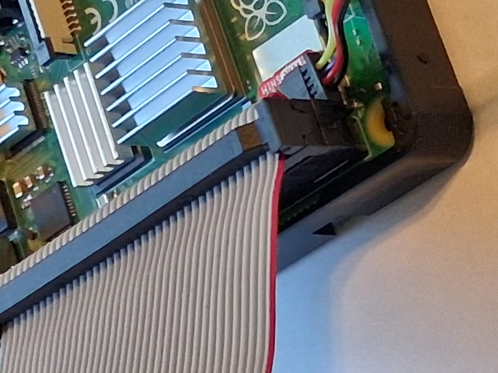
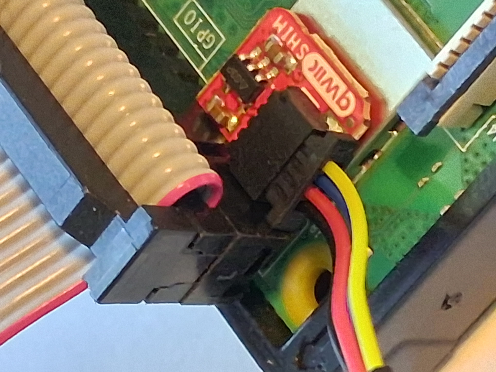
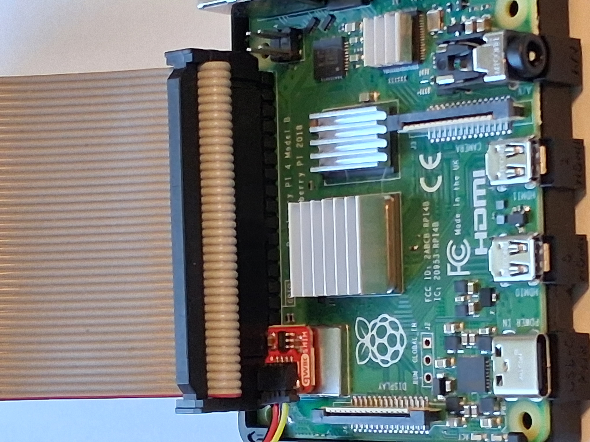
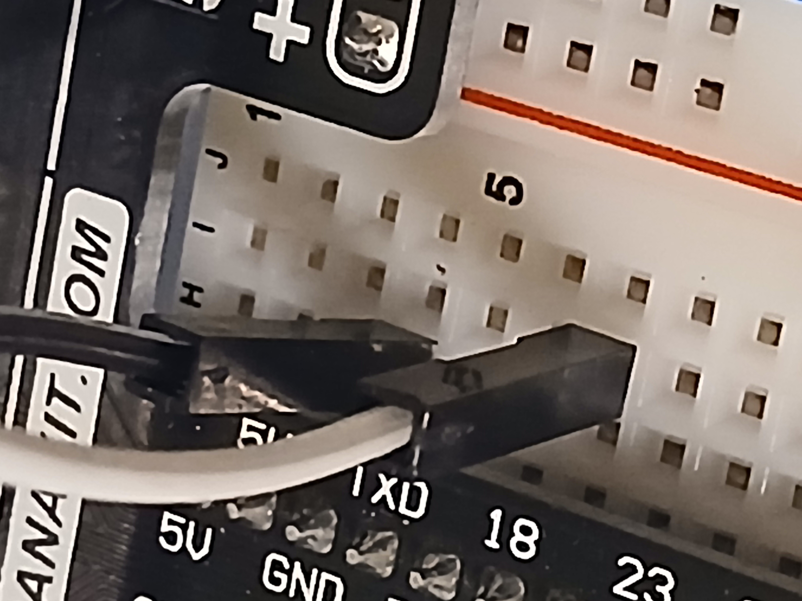
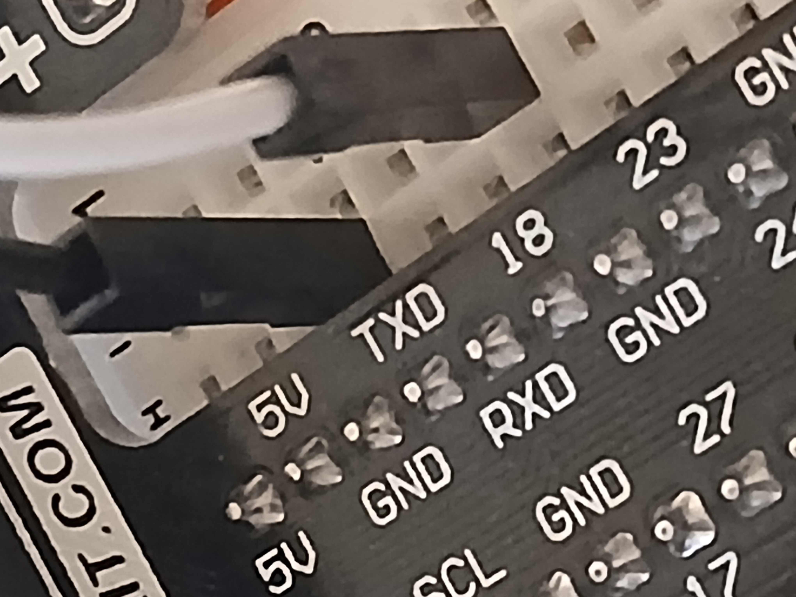
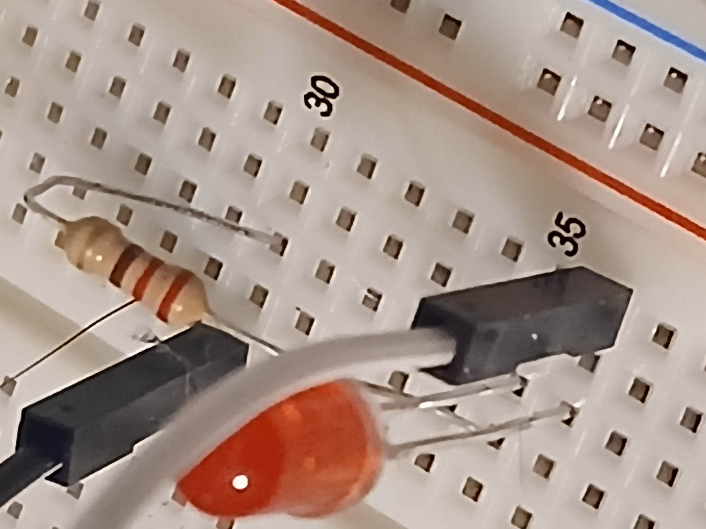
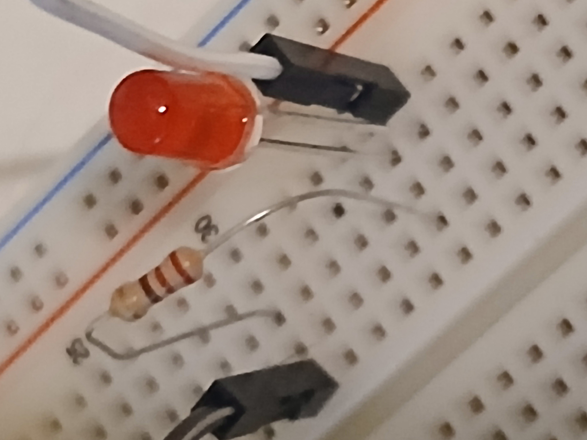

# Overview

This week is all about getting set up for the rest of the course.

# Qwiic Shim Setup

The [SparkFun Qwiic Shim](https://www.adafruit.com/product/4463?srsltid=AfmBOop4uiiC7y1YL899XXgjB8vgjPS22l7xIyDs6VNgux3Ahi4JlUGa) is
placed on the Raspberry Pi's GPIO.

Place the Qwiic Shim on the Raspberry Pi's GPIO pins _and then_ connect the 40-pin GPIO ribbon cable.

Once that is done, connect the four-pin cable.

<figure>
  
  <figcaption><em>Figure 1: Qwiic Shim and 4-pin connector</em></figcaption>
</figure>

<figure>
  
  <figcaption><em>Figure 2: Qwiic Shim and 4-pin connector, close up</em></figcaption>
</figure>

<figure>
  
  <figcaption><em>Figure 3: Qwiic Shim connected to Raspberry Pi</em></figcaption>
</figure>

# LED Wiring

You will need the 220-ohm resistor, LED, and two jumper wires (one black and one white, 
if you want to follow along with the colors) for this section.

<figure>
  
  <figcaption><em>Figure 4: 220 ohm resistor</em></figcaption>
</figure>

The white wire for the LED should be placed in __row 7__ of the breadboard, which is connected to GPIO18 on the Raspberry Pi.

<figure>
  
  <figcaption><em>Figure 5: White wire into row 7</em></figcaption>
</figure>

The black wire for the LED should be placed in __row 4__ of the breadboard, which is connected to the __ground (GND)__ pin on the Raspberry Pi.

<figure>
  
  <figcaption><em>Figure 6: Black wire into row 4</em></figcaption>
</figure>

The LED should be placed so that the longer leg (anode) is in __row 36__ and the shorter leg (cathode) is in __row 35__.

The rest of the wiring should be done as follows:

* The white wire should connect to the anode in __row 36__ from __row 7__ (which we already connected).
* The 220-ohm resistor should connect from __row 35__ to __row 30__ 
* The black wire should connect go from __row 30__ to __ground__ in __row 4__ (which we already connected).

<figure>
  
  <figcaption><em>Figure 7: LED wiring</em></figcaption>
</figure>

<figure>
  
  <figcaption><em>Figure 8: Another angle of the LED wiring</em></figcaption>
</figure>