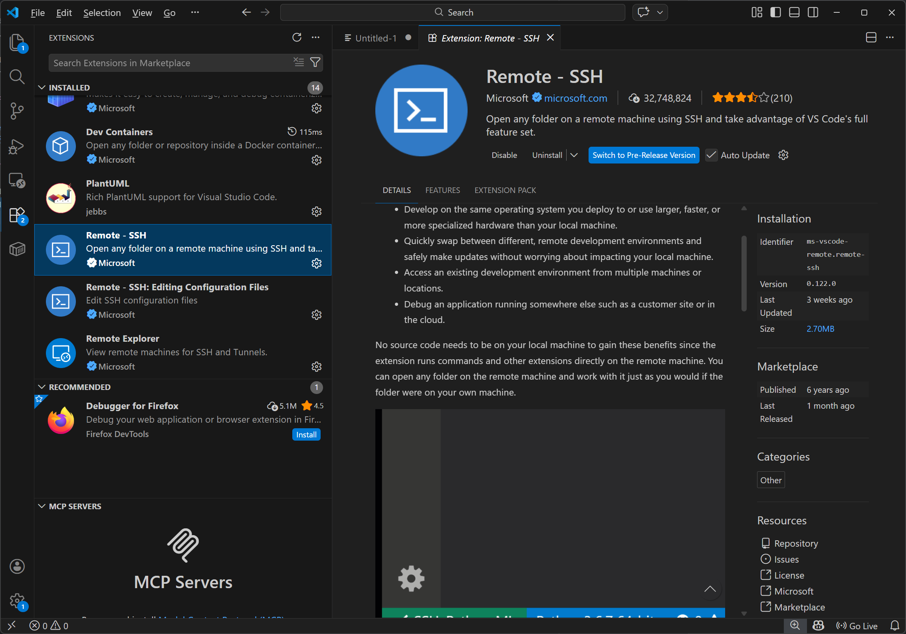
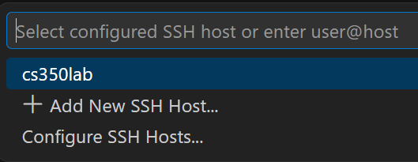
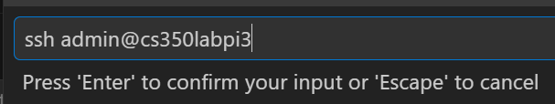
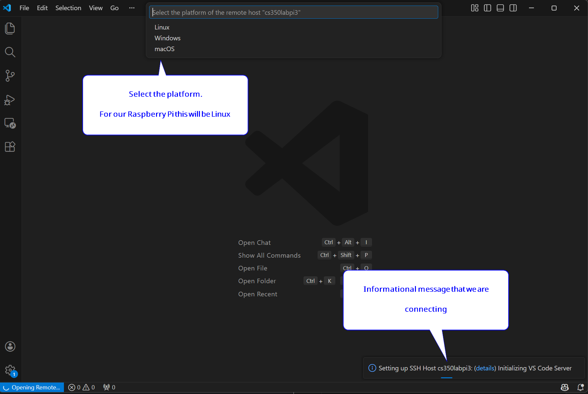
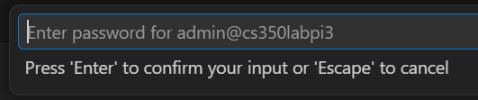
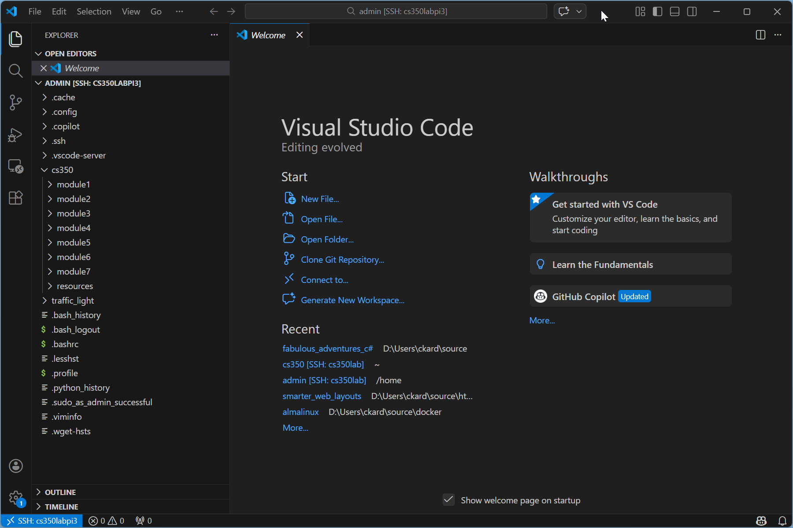

# Connecting Visual Studio Code to the Raspberry Pi

## Overview

This guide will show you how to connect Visual Studio Code (VS Code) to your Raspberry Pi, allowing you to develop and 
debug your code directly on your Raspberry Pi from your local machine.

I also recommend becoming familiar with tools such as `vi` on Unix/Linux/MacOS, because you may need to edit files directly on a server
without the aid of a GUI and it is a safe bet that some form of `vi` will be available.

## Prerequisites

* [Visual Studio Code](https://code.visualstudio.com/)
* [Remote - SSH extension for Visual Studio Code](https://code.visualstudio.com/docs/remote/ssh)

# Procedure

1. Install Visual Studio Code
2. Install the Remote - SSH extension in Visual Studio Code
<figure>
  
  <figcaption><em>Figure 1: Installed extensions for VS Code</em></figcaption>
</figure>
3. Open the Command Palette (Ctrl+Shift+P) and select "Remote-SSH: Connect to Host...". In Figure 2 you can see that I already
have a connection to my Raspberry Pi setup called `cs350lab`. I will be creating a new one to an older Raspberry Pi 3.  
<figure>
  
  <figcaption><em>Figure 2: Add New SSH Host</em></figcaption>
</figure>
4. After selecting "Add New SSH Host...", you will be prompted to enter the SSH connection string. This typically looks like `ssh username@hostname`.
In my case, the hostname is `cs350labpi3` and my username is `admin`, so I will enter `ssh admin@cs350labpi3`.
5. You will then be prompted to select the SSH configuration file to update. Choose the default option, which is usually `~/.ssh/config`.
<figure>
  
  <figcaption><em>Figure 3: SSH Configuration</em></figcaption>
</figure>
6. Then we can try connecting, and we will need to specify an Operating System
<figure>
  
  <figcaption><em>Figure 4: SSH Operating System</em></figcaption>
</figure>
7. Then you will be prompted to enter the password for the user on the Raspberry Pi. 
<figure>
    
    <figcaption><em>Figure 5: SSH Password Prompt</em></figcaption>
</figure>

You should now be connected to your Raspberry Pi.  You may have to "Trust" the remote connection so that you can browse and open files.

You can also open a terminal in VS Code (Ctrl+`) and it will open a terminal session on your Raspberry Pi, allowing you to run commands directly on the Pi from VS Code.

<figure>
    
    <figcaption><em>Figure 6: VS Code Connected to Raspberry Pi</em></figcaption>
</figure>