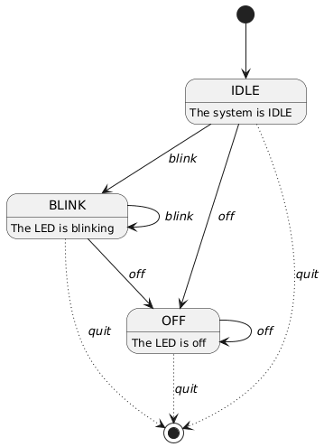

# Module 3

Explore the Universal Asynchronous Receiver/Transmitter (UART) 

## Overview

The `led_client.py` script can pass commands to the `led_server.py` script using UART communication. 

It accepts the following commands:
* `blink` - LED on the server side will blink on and off
* `off` - LED on the server side will turn off
* `quit` - Both the server and client will exit

Below is a PlantUML state diagram illustrating the states and transitions of the LED server.

```
@startuml

[*] --> IDLE

IDLE : The system is IDLE

IDLE --> BLINK : <i>blink</i>
IDLE -[dotted]-> [*] : <i>quit</i>
IDLE --> OFF: <i>off</i>

BLINK : The LED is blinking
BLINK --> BLINK: <i>blink</i>
BLINK --> OFF: <i>off</i>
BLINK -[dotted]-> [*]: <i>quit</i>

OFF: The LED is off
OFF --> OFF: <i>off</i>
OFF -[dotted]-> [*]: <i>quit</i>

@enduml
```

PlantUML will use the previous definition to generate the diagram.

I used dotted lines to indicate transitions that lead to the termination of the program because it helps to visually 
separate those transitions from the more interesting states.

<figure>
  
  <figcaption><em>Figure 1: PlantUML Diagram of our state machine</em></figcaption>
</figure>
