# Overview

This week we will be setting up a 16x2 LCD display.

These wiring instructions can be used to help supplement the wiring diagram provided in the lab. We specify wire colors in the
instructions to help provide some clarity on the wiring, but you can use any color wire you like.  

This is the most complex wiring we will undertake in the course.  

Please follow the wiring instructions both here and in the actual lab document carefully, and to double-check your wiring before powering on the circuit.

# LCD 16x2 Setup

Place the potentiometer on the breadboard as shown in Figure 1.

It should span __Row 45__ through __Row 47__, and __Column G__ through __Column J__.  We will need the potentiometer to adjust the contrast of the LCD display 
later on.

<figure>
  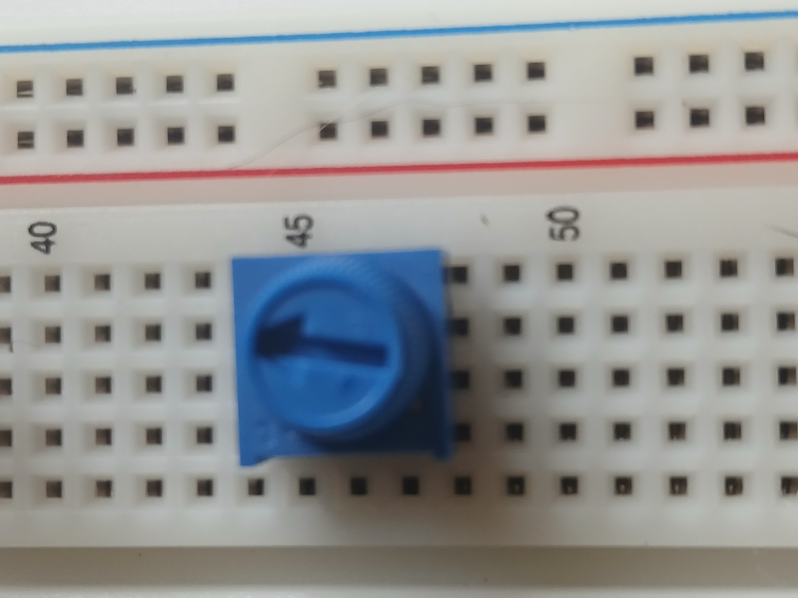
  <figcaption><em>Figure 1: Potentiometer on the breadboard</em></figcaption>
</figure>

We place the LCD display on the breadboard as shown in Figures 2 and 3.  The LCD display should span __Row 62__ through
__Row 47__, and sit in __Column A__.

<figure>
  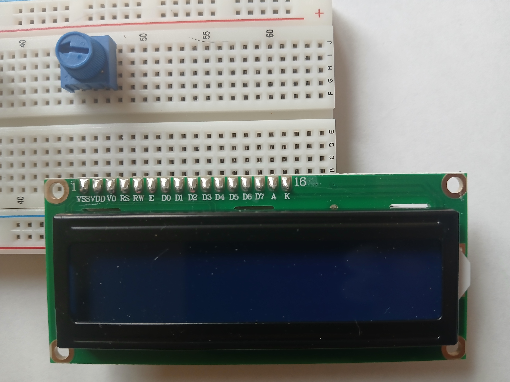
  <figcaption><em>Figure 2: Placing the LCD</em></figcaption>
</figure>

<figure>
  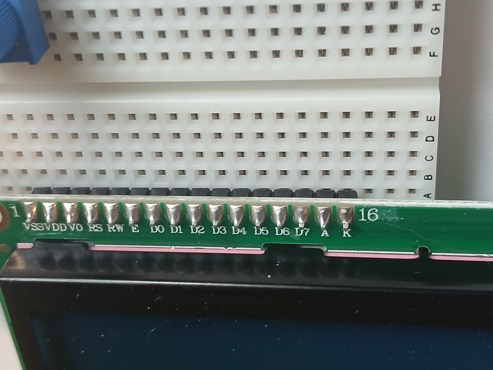
  <figcaption><em>Figure 3: Another angle of the LCD</em></figcaption>
</figure>

We first connect Pin 1 (VSS) of the LCD display located in __Row 47__, to GND (__Row 18__) on the breadboard as shown in Figure 4 and
Figure 5.

<figure>
  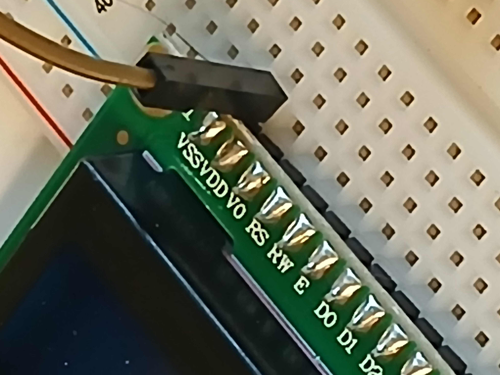
  <figcaption><em>Figure 4: VSS Wiring</em></figcaption>
</figure>

<figure>
  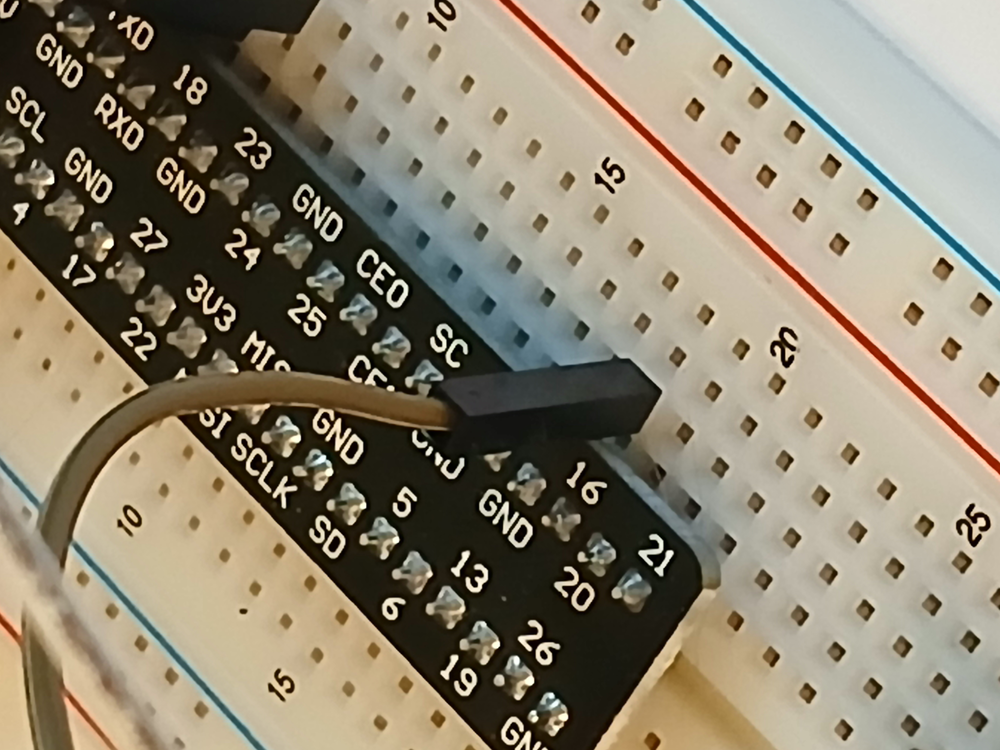
  <figcaption><em>Figure 5: VSS Wiring to the breadboard</em></figcaption>
</figure>

We have additional ground wires (yellow and orange wires) in Figures 6 and 7.

The yellow wire connects the 5th pin of the LCD display (RW) located in __Row 51__ to GND (__Row 18__) on the breadboard.  

The orange wire connects the 16th pin of the LCD display (K) located in __Row 62__ to GND (__Row 18__) on the breadboard.

<figure>
  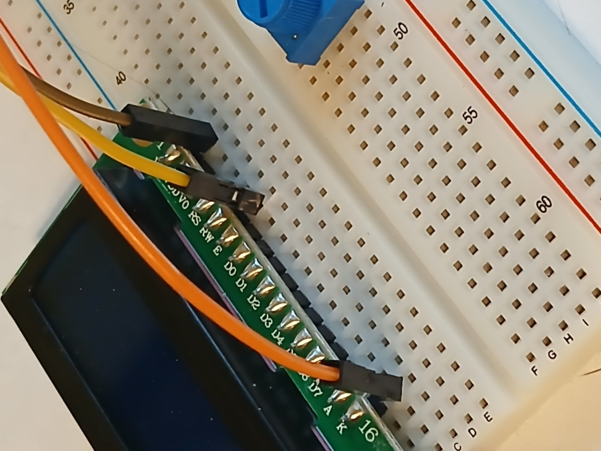
  <figcaption><em>Figure 6: Additional ground wires</em></figcaption>
</figure>

Both the yellow and orange wires are connected to the same GND pin on the breadboard in __Row 18__.

<figure>
  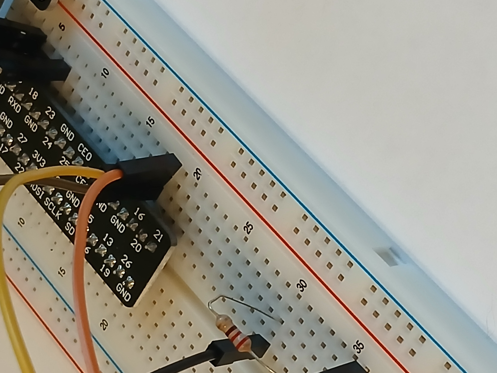
  <figcaption><em>Figure 7: Additional ground wires to the GPIO breakout</em></figcaption>
</figure>

Next, we can connect the potentiometer using a white wire from __Row 45__

<figure>
  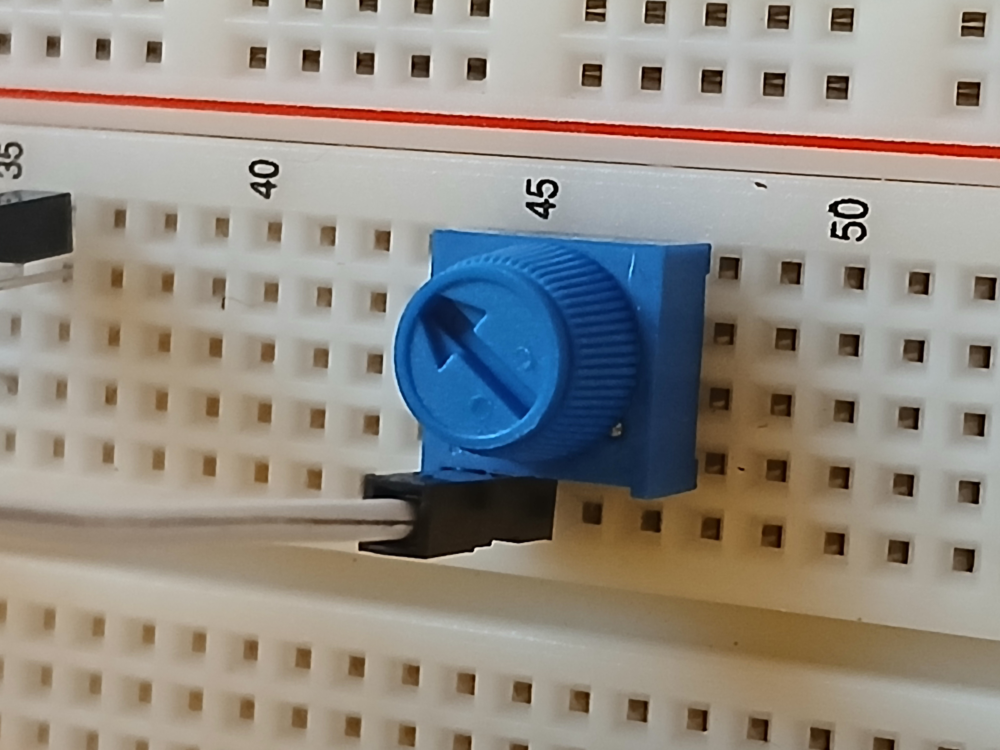
  <figcaption><em>Figure 8: White wire on the potentiometer</em></figcaption>
</figure>

We then connect the white wire from the potentiometer to GND (__Row 16__) on the breadboard as shown in Figures 9 and 10.

<figure>
  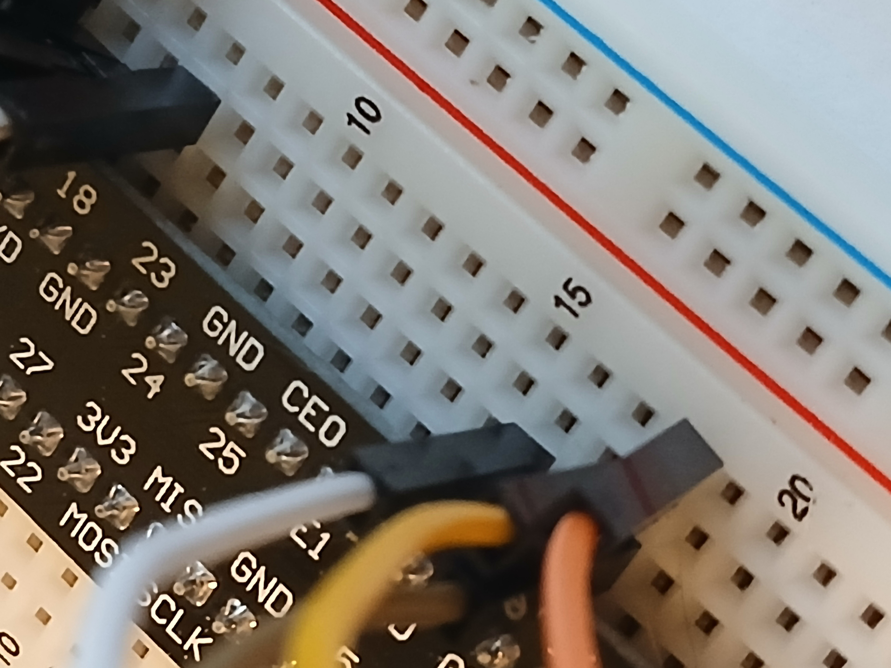
  <figcaption><em>Figure 9: White wire to GND on GPIO breakout</em></figcaption>
</figure>

<figure>
  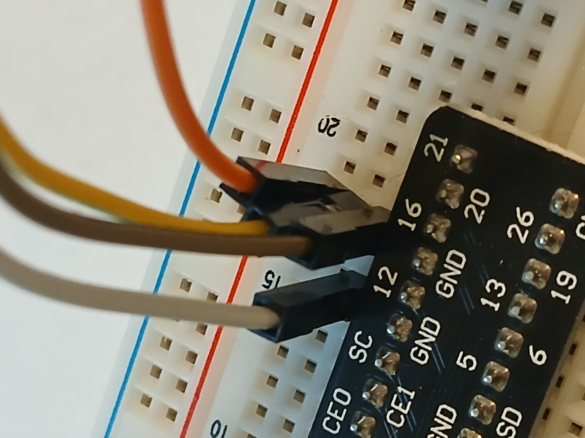
  <figcaption><em>Figure 10: Another angle of the white wire going to GND</em></figcaption>
</figure>

We connect a purple wire from the 2nd pin of the potentiometer located in __Row 46__ to the 3rd pin of the LCD display (V0)
located in __Row 49__ as shown in Figure 11.

<figure>
  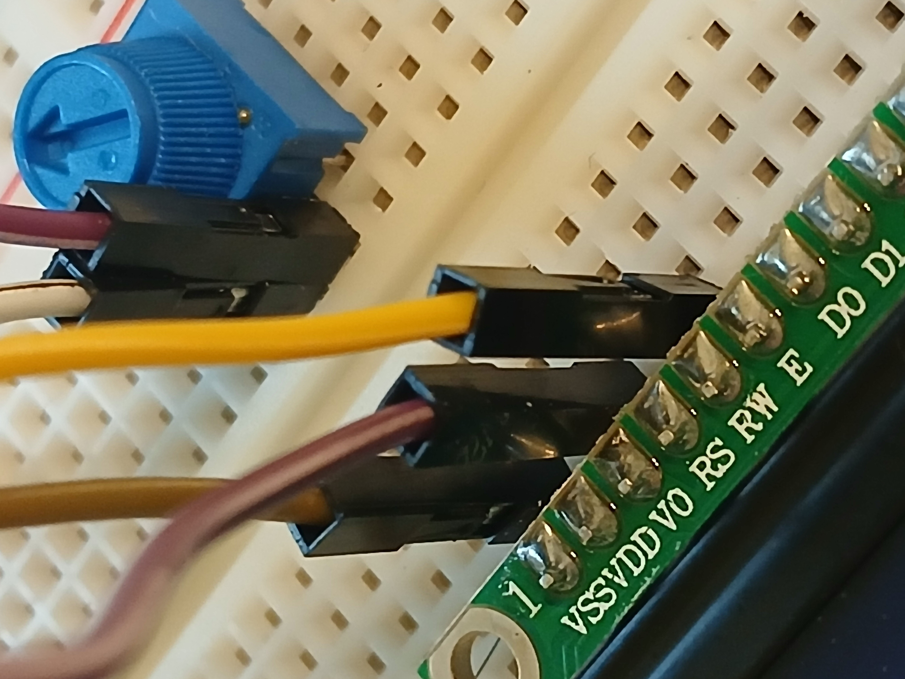
  <figcaption><em>Figure 11: White wire to GND on GPIO breakout</em></figcaption>
</figure>

Now, we make some connections to the +5V on the breadboard.

* Green wire goes from Pin 2 of the LCD display (VDD) located in __Row 48__ to +5V (__Row 31__) on the breadboard.
* Red wire goes from Pin 15 of the LCD display (A) located in __Row 61__ to +5V (__Row 32__) on the breadboard.
* Brown wire goes from Pin 3 of the potentiometer located in __Row 47__ to +5V (__Row 33__) on the breadboard.

<figure>
  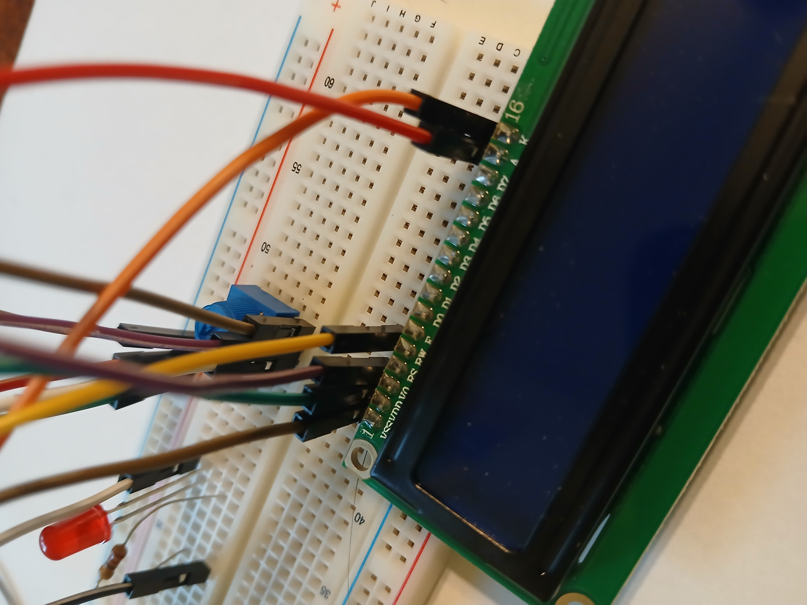
  <figcaption><em>Figure 12: Wires going to +5V, angle 1</em></figcaption>
</figure>

<figure>
  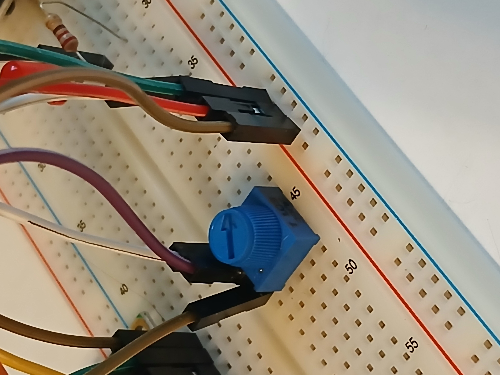
  <figcaption><em>Figure 13: Wires going to +5V, angle 2</em></figcaption>
</figure>

Now we make the remaining connections needed for the LCD display as shown in Figures 14, 15, 16, and 17.

* Red wire from GPIO 17 (__Row 7__) to Pin 15 of the LCD display (A) located in __Row 61__
* Orange wire from GPIO 27 (__Row 8__) to Pin 6 of the LCD display (E) located in __Row 50__
* Black wire from GPIO 5 (__Row 16__) to Pin 11 of the LCD display (D4) located in __Row 56__
* Gray wire from GPIO 6 (__Row 17__) to Pin 12 of the LCD display (D5) located in __Row 57__
* Blue wire from GPIO 13 (__Row 18__) to Pin 13 of the LCD display (D6) located in __Row 59__
* Yellow wire from GPIO 26 (__Row 20__) to Pin 14 of the LCD display (D7) located in __Row 60__

<figure>
  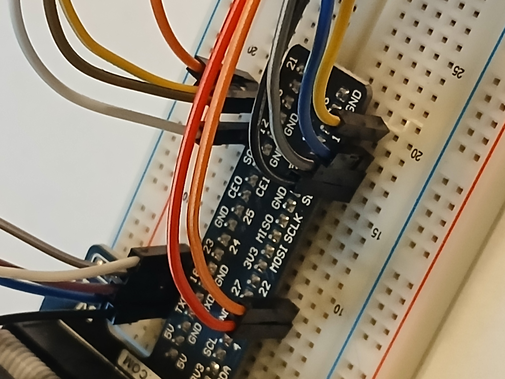
  <figcaption><em>Figure 14: GPIO Connections for LCD, angle 1</em></figcaption>
</figure>

<figure>
  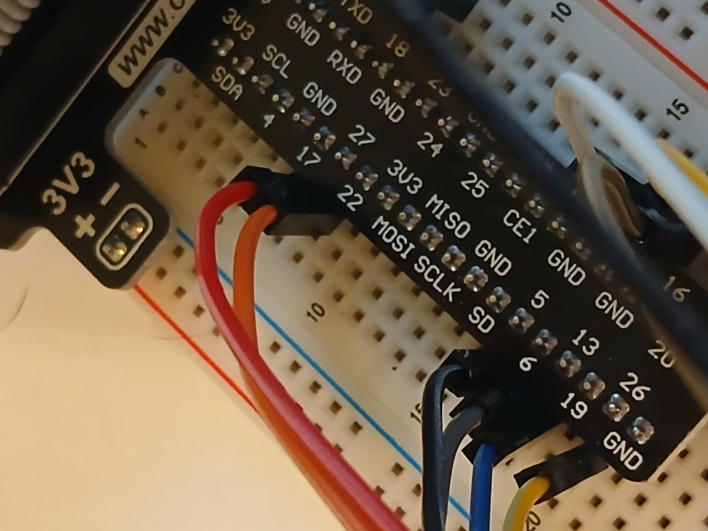
  <figcaption><em>Figure 15: GPIO Connections for LCD, angle 2</em></figcaption>
</figure>

<figure>
  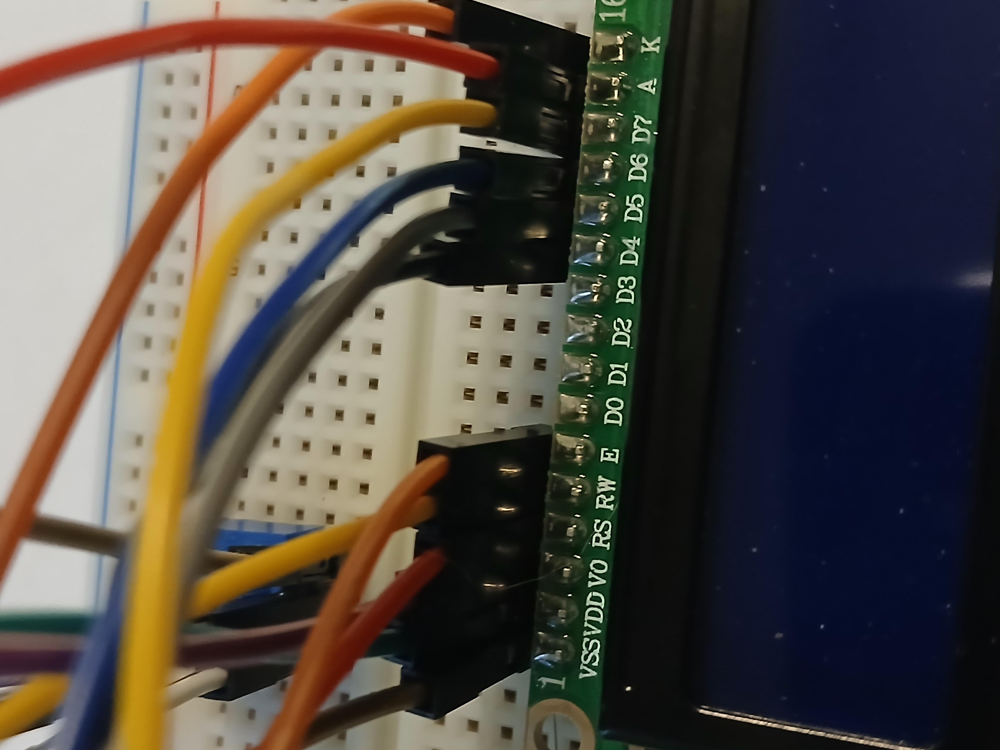
  <figcaption><em>Figure 16: LCD connections, angle 1</em></figcaption>
</figure>

<figure>
  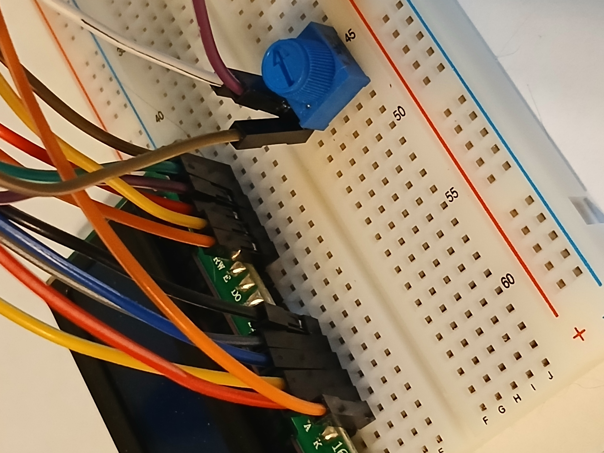
  <figcaption><em>Figure 17: LCD connections, angle 2</em></figcaption>
</figure>

You should now be able to follow the rest of the lab instructions to test the LCD display, remember to adjust the potentiometer to adjust the contrast of the display. 

<figure>
  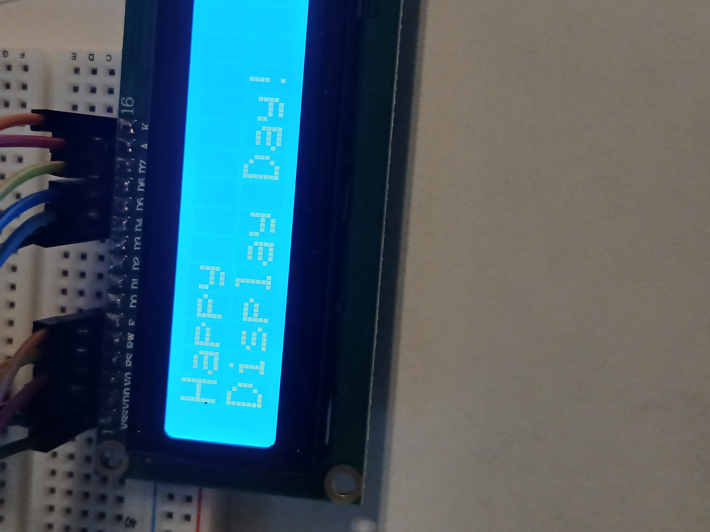
  <figcaption><em>Figure 18: LCD working</em></figcaption>
</figure>