# Wiring the button

You can use which ever button color you want. However, it may make it easier to follow along if you use the same button color.
Additionally, I will mention the color of the wires I am using, but you can use any color you want.  Again, it will make it easier
to follow along if you use the same color wires.

The buttons are in two pieces.

<figure>
  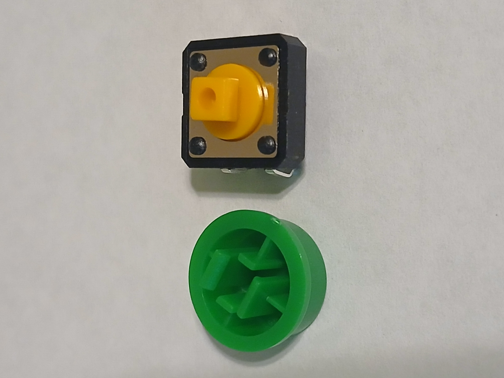
  <figcaption><em>Figure 1: Green button pieces</em></figcaption>
</figure>

The pieces just snap together, so you can simply press them together being careful 
not to break the legs on the bottom of the button.

The assembled button should look like this:

<figure>
  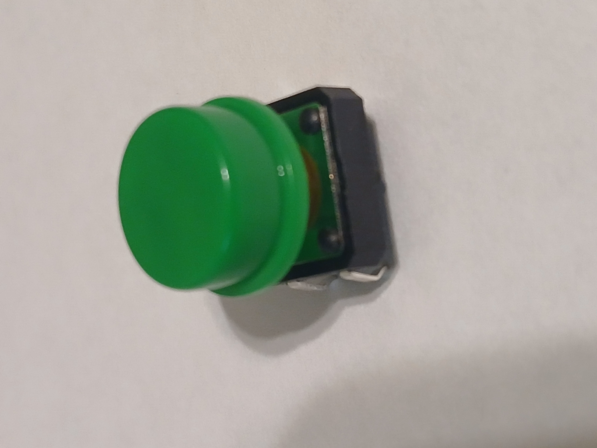
  <figcaption><em>Figure 2: The assembled button</em></figcaption>
</figure>

Place the button on the breadboard with pins at __Row 25__ and __Row 27__.  It will span the 
gap in the middle of the breadboard, going from __Column D__ to __Column G__, as shown in Figure 3. 

<figure>
  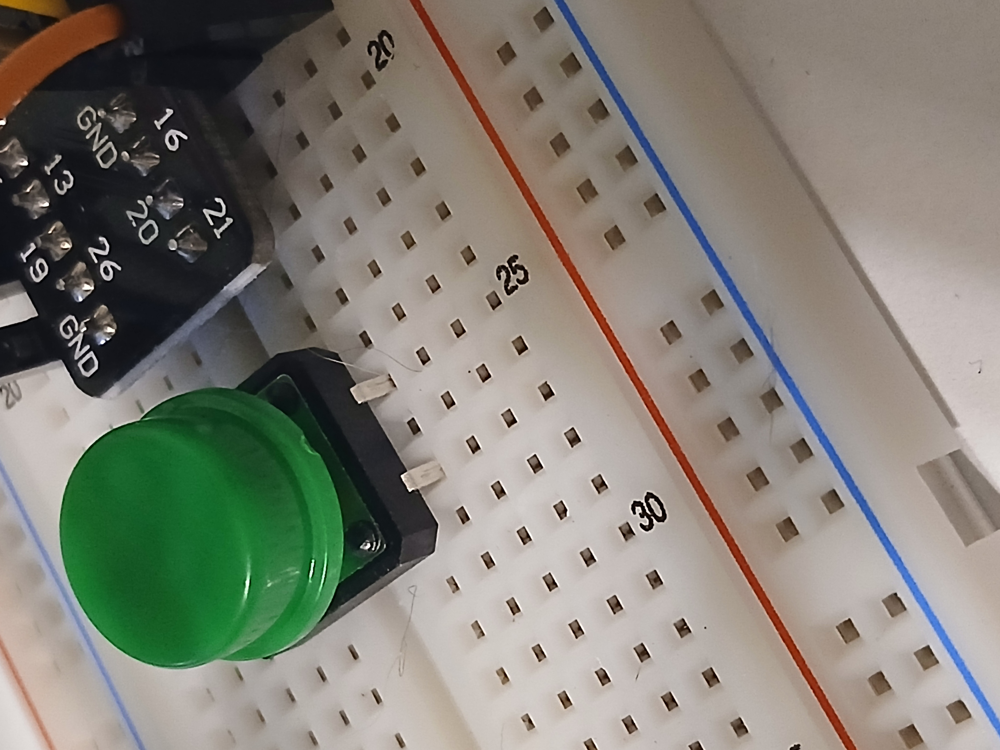
  <figcaption><em>Figure 3: Green button placement</em></figcaption>
</figure>

Next, we will connect a 10k ohm resistor to the button.

<figure>
  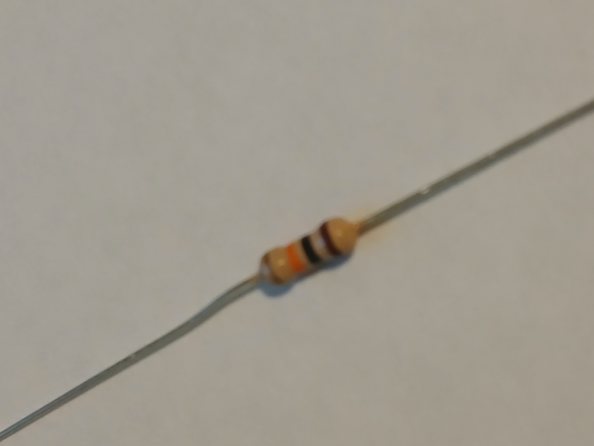
  <figcaption><em>Figure 4: 10k ohm resistor</em></figcaption>
</figure>

Place the resistor on the breadboard in __Row 25__, __Column A__ and over to the __+3.3v__ power rail as shown in 
Figure 5.

<figure>
  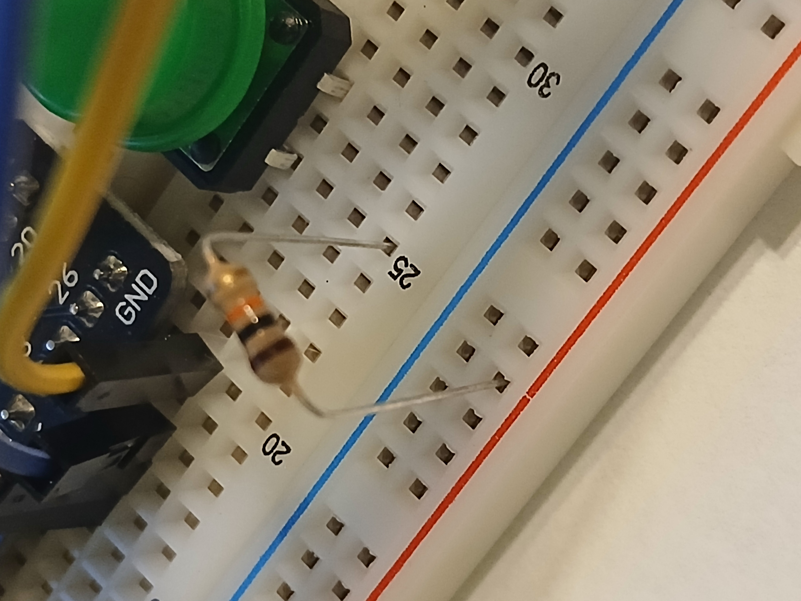
  <figcaption><em>Figure 5: Placing the 10k ohm resistor</em></figcaption>
</figure>

Then we will connect a brown wire from the __GND GPIO pin__ 

<figure>
  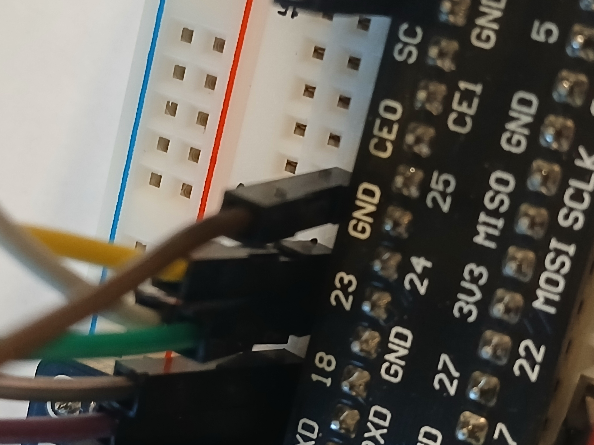
  <figcaption><em>Figure 6: Connecting the ground wire</em></figcaption>
</figure>

To __Row 27__, __Column H__ of the button as shown in Figure 7.

<figure>
  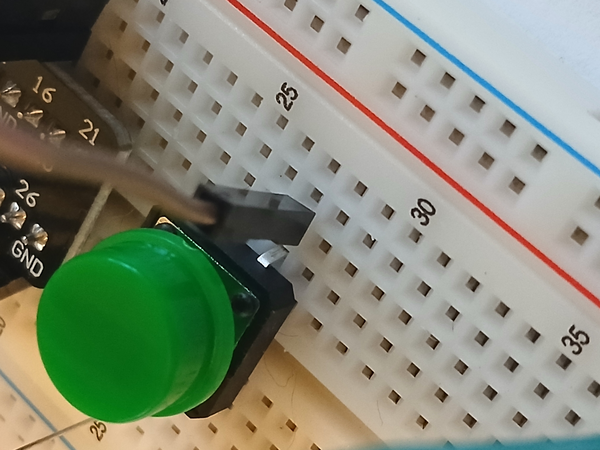
  <figcaption><em>Figure 7: Placing the ground wire</em></figcaption>
</figure>

Add an orange wire from __Row 25__, __Column H__ of the button as shown in Figure 8.

<figure>
  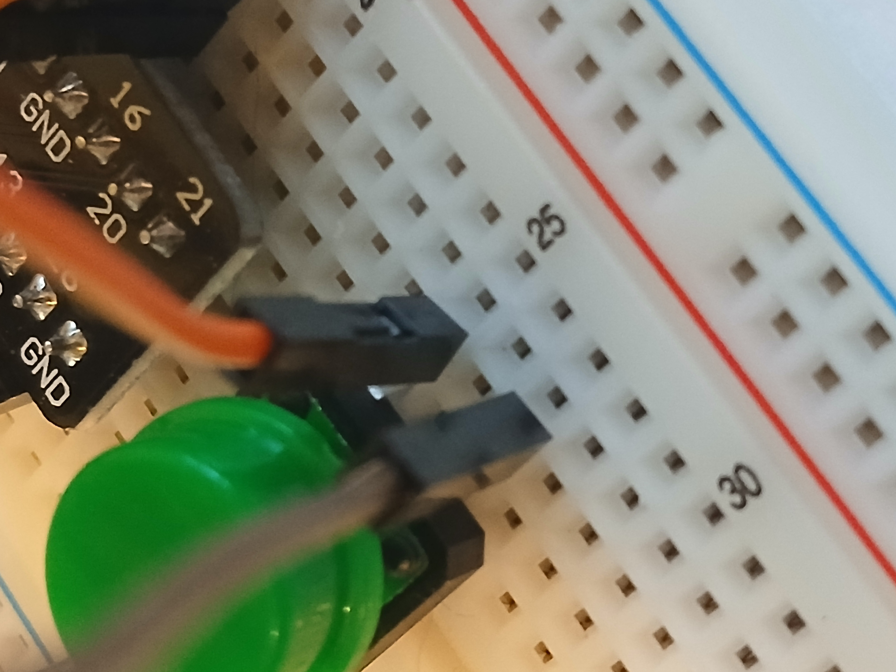
  <figcaption><em>Figure 8: Connecting the signal wire</em></figcaption>
</figure>

 To the __GPIO 24__ pin as shown in Figure 9.

<figure>
  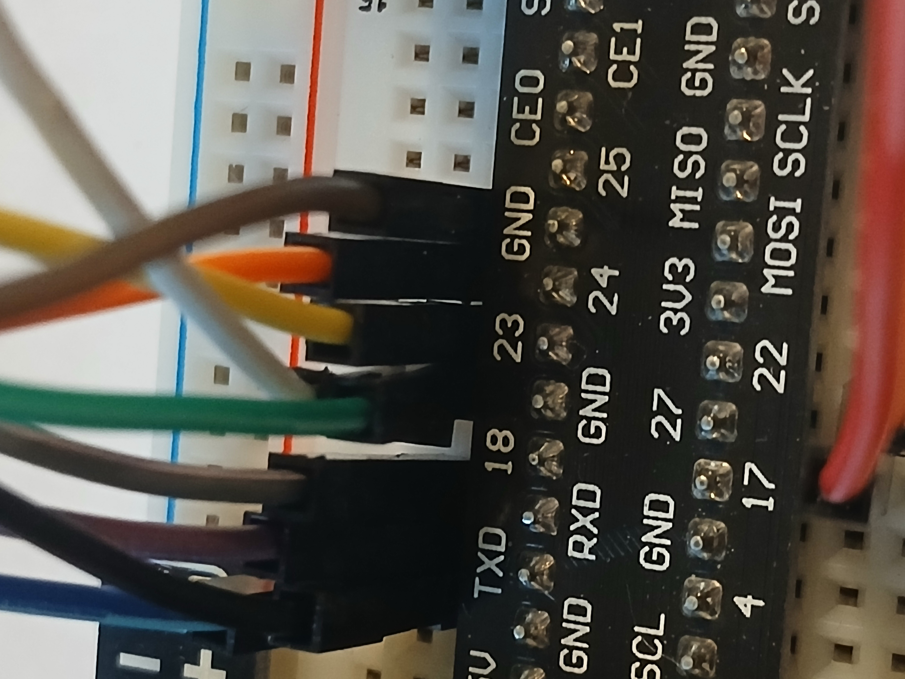
  <figcaption><em>Figure 9: Connecting the signal wire to GPIO 24</em></figcaption>
</figure>

At this point the wiring of the button is complete.  Here is an overview of the completed wiring for the project so far.

<figure>
  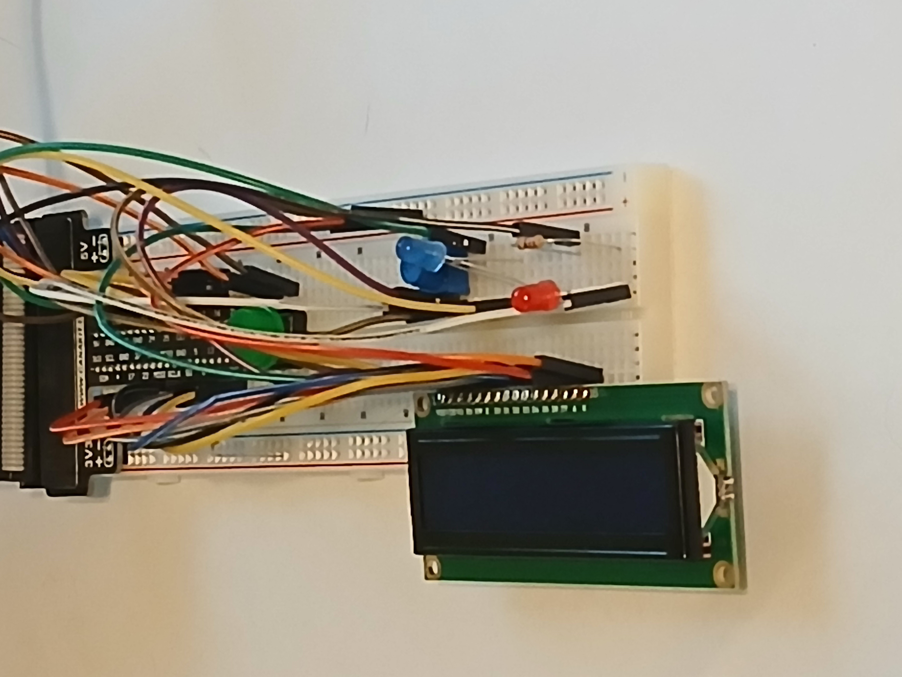
  <figcaption><em>Figure 10: Completed wiring, angle 1</em></figcaption>
</figure>

And here is another angle of the completed wiring.

<figure>
  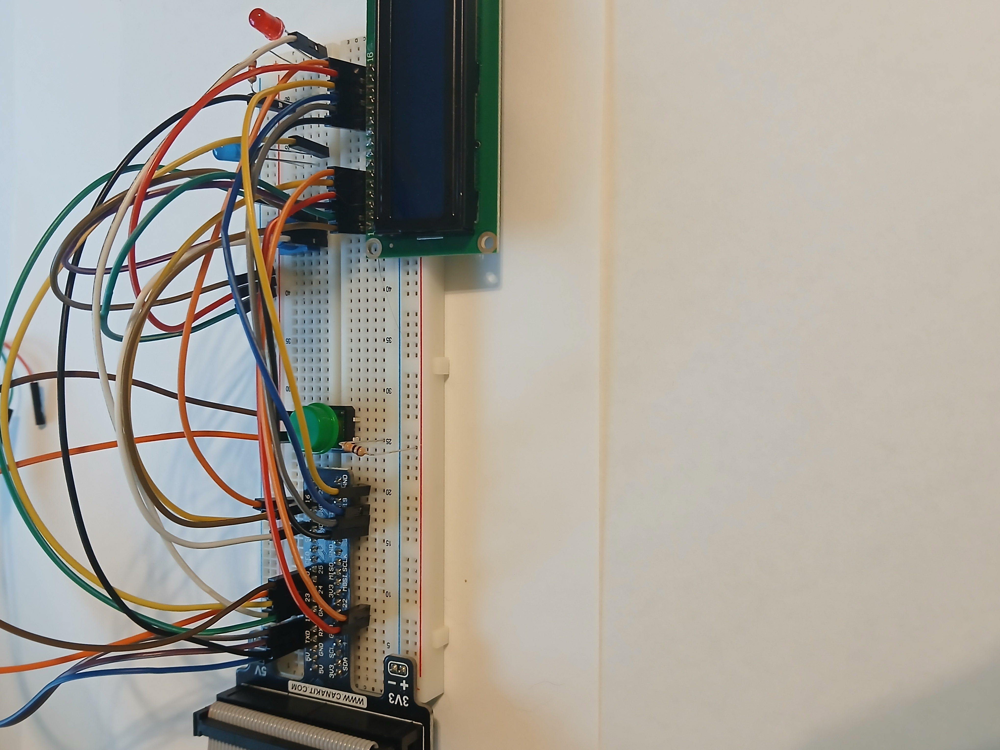
  <figcaption><em>Figure 11: Completed wiring, angle 2</em></figcaption>
</figure>

Both LEDs should be wired (assuming you followed along with the LED wiring before the button). So, you
should be able to run the test script for the lab to verify the button is working.

Pressing the button will cause the Red LED to turn on as shown in Figure 12.

<figure>
  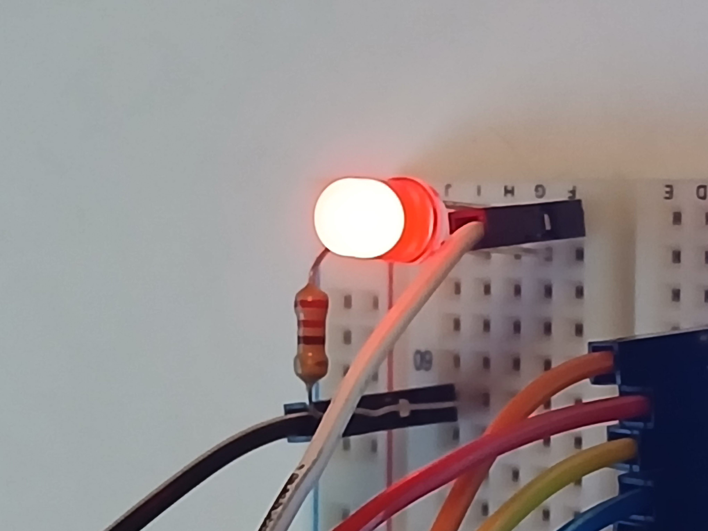
  <figcaption><em>Figure 12: Red LED on</em></figcaption>
</figure>

Pressing the button again will change the light to the Blue LED as shown in Figure 13.

<figure>
  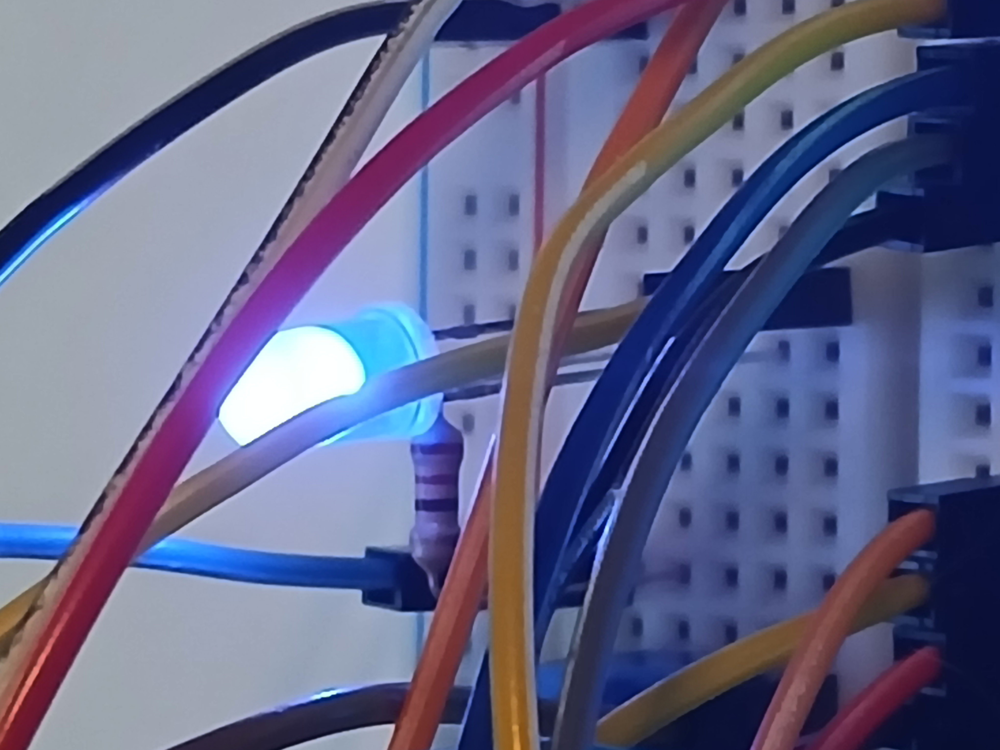
  <figcaption><em>Figure 13: Blue LED on</em></figcaption>
</figure>

That's it for the button wiring!