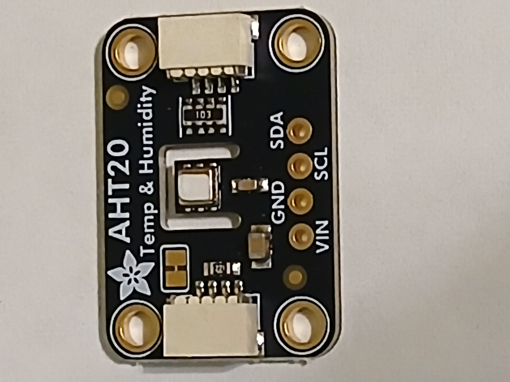
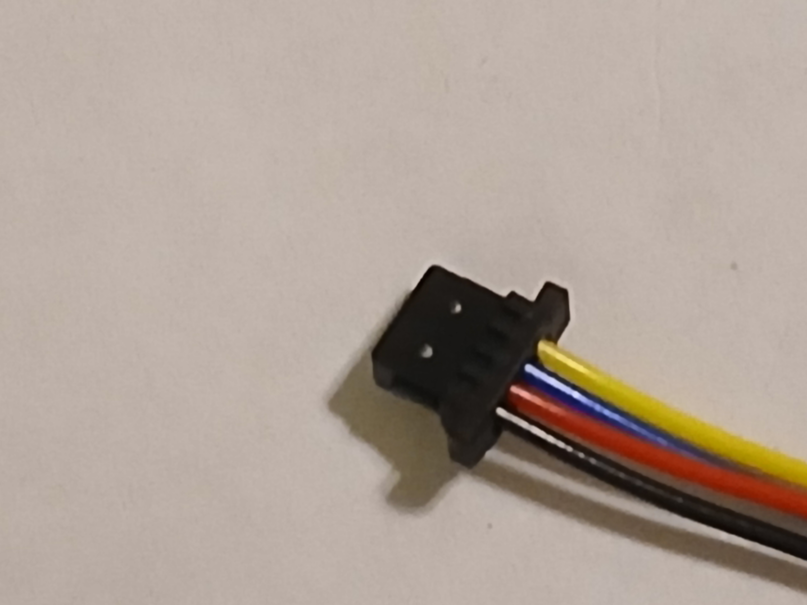
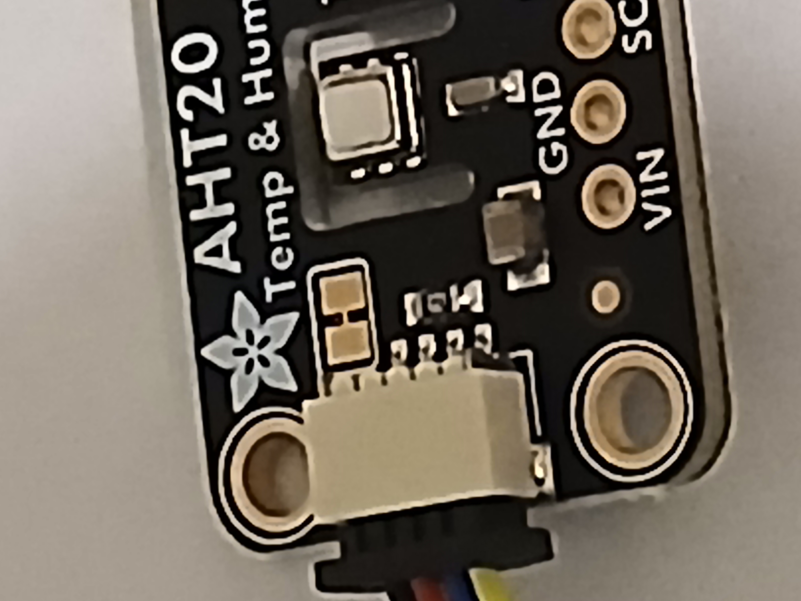
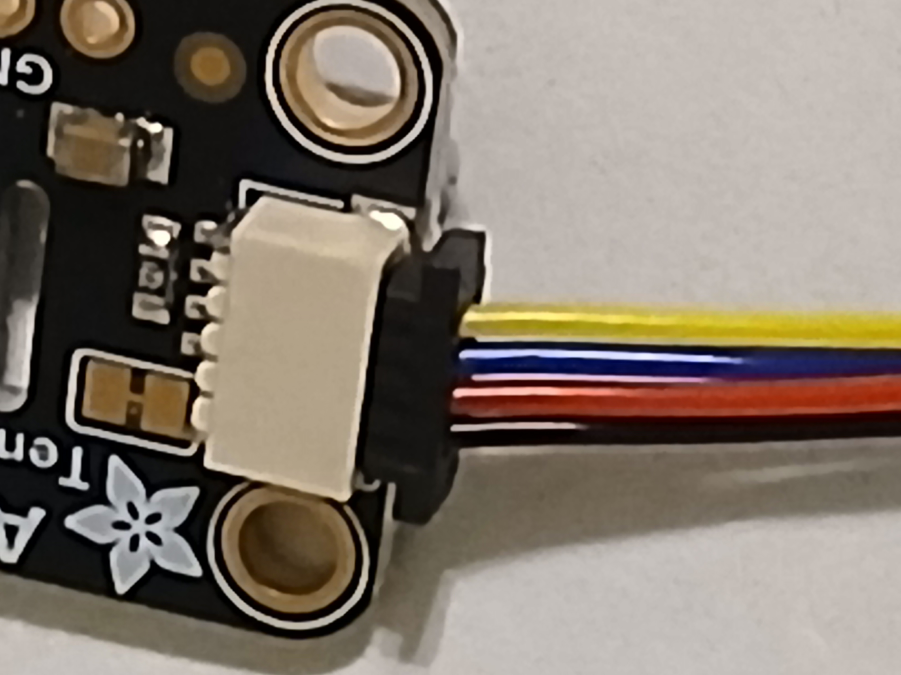
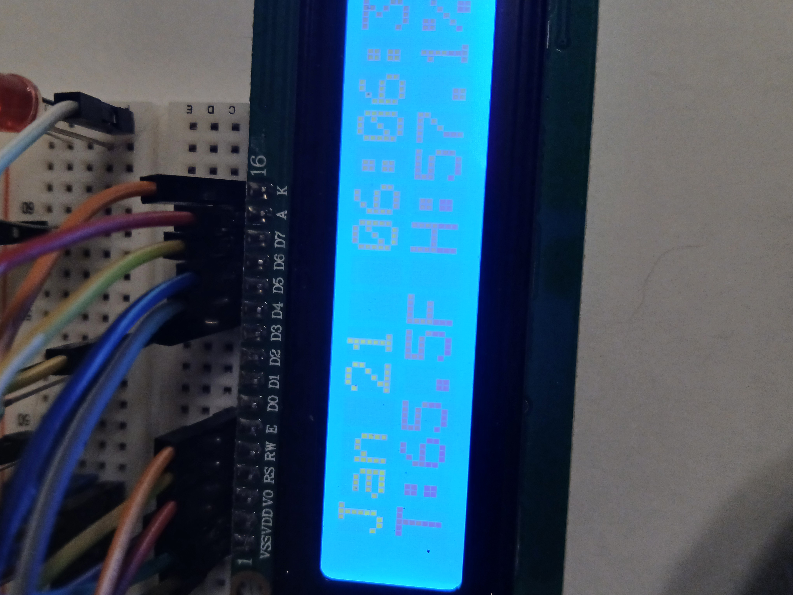
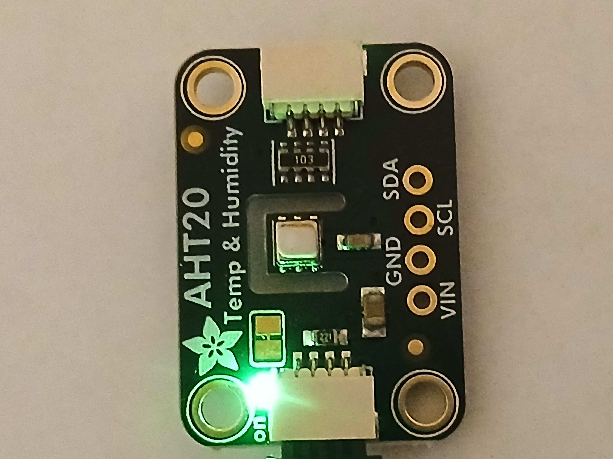

# Overview

This week we are wiring the temperature sensor.

Because of the shim we installed on our Raspberry Pi, we will not need to use the breadboard for this.

# Connecting the Temperature Sensor

Find the AHT20 sensor that you ordered

<figure>
  
  <figcaption><em>Figure 1: The AHT20 Temp and Humidity Sensor</em></figcaption>
</figure>

Use the QWIIC Cable, it can only be inserted one way

<figure>
  
  <figcaption><em>Figure 2: QWIIC Cable</em></figcaption>
</figure>

The below figure shows the cable inserted into the sensor

<figure>
  
  <figcaption><em>Figure 3: QWIIC Cable connected, angle 1</em></figcaption>
</figure>

Another angle of the cable inserted into the sensor

<figure>
  
  <figcaption><em>Figure 4: QWIIC cable connected, angle 2</em></figcaption>
</figure>

Running the test script should show the date, time, temperature, and humidity

<figure>
  
  <figcaption><em>Figure 5: LCD Output showing Temperature and Humidity</em></figcaption>
</figure>

The figure below shows the light on the sensor indicating it is powered

<figure>
  
  <figcaption><em>Figure 6: AHT20 Sensor powered on</em></figcaption>
</figure>
