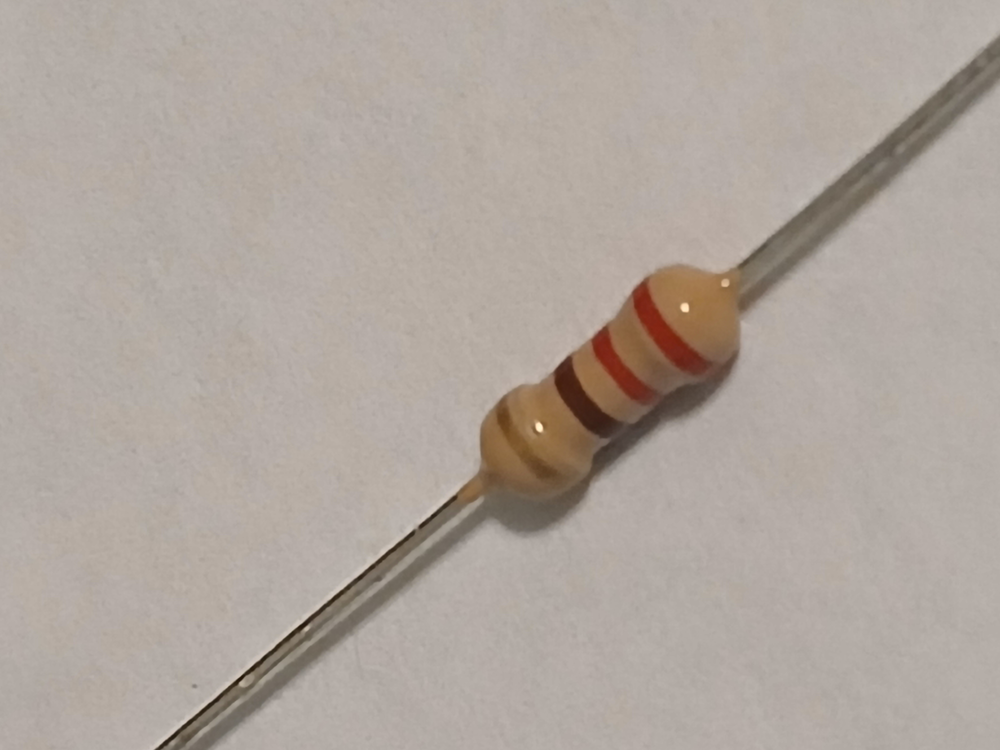
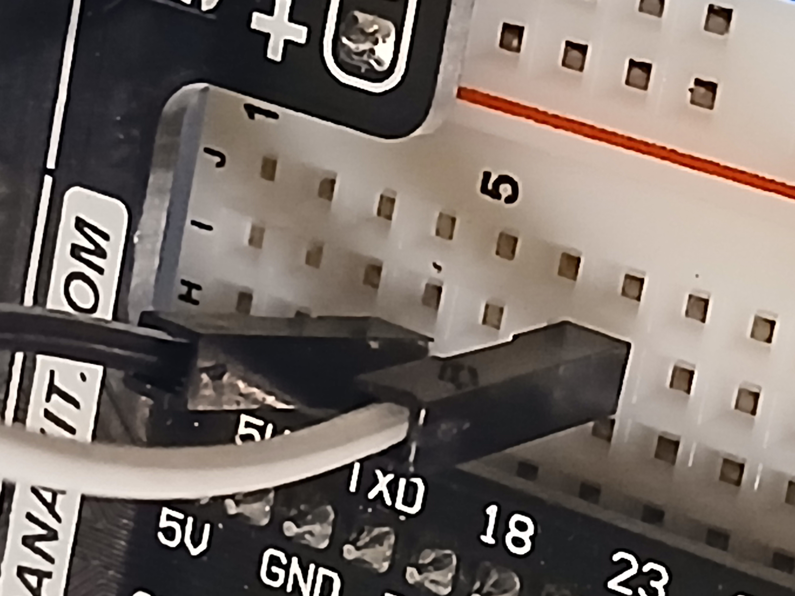
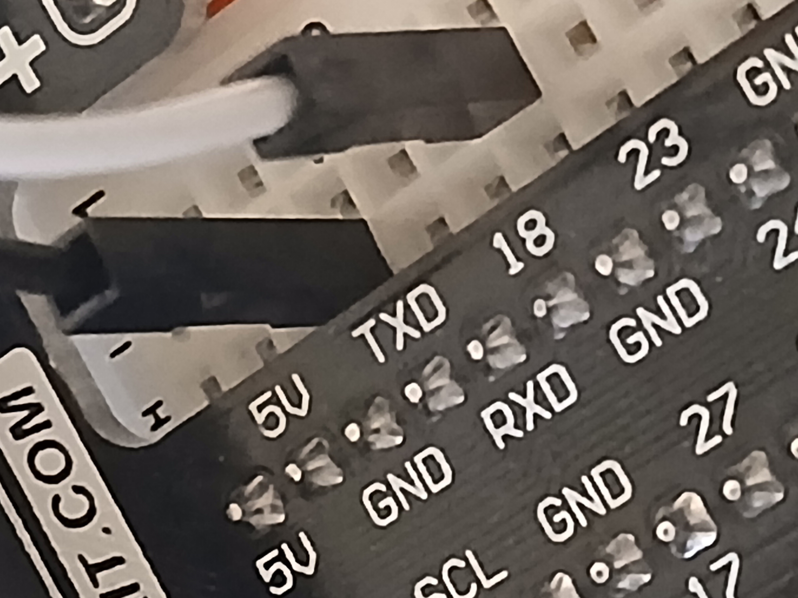
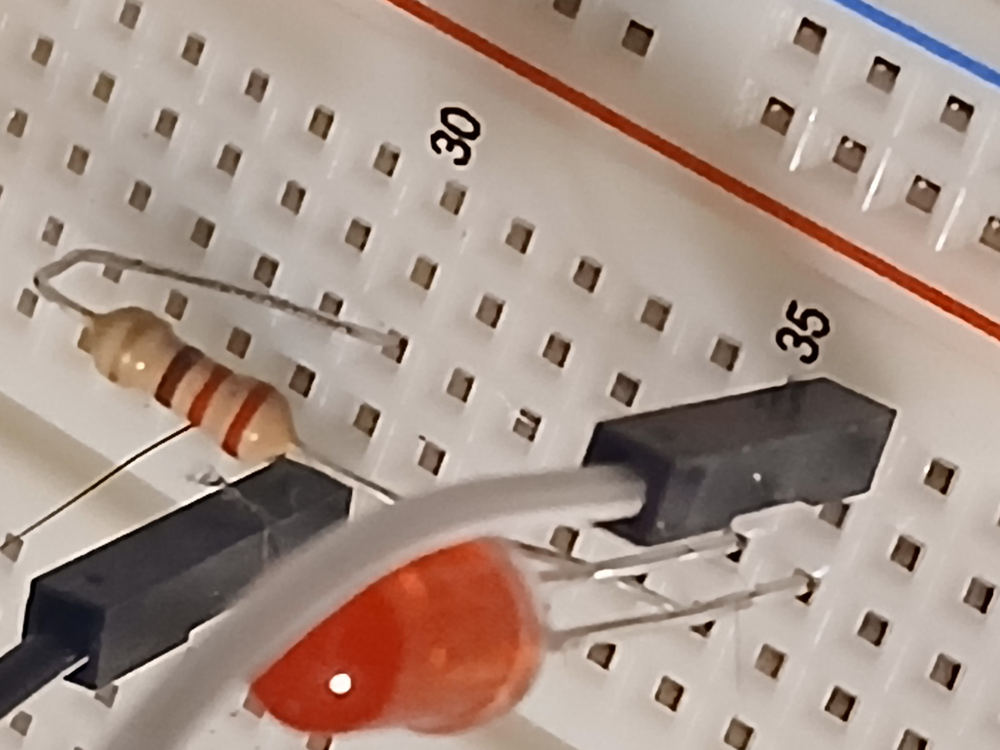
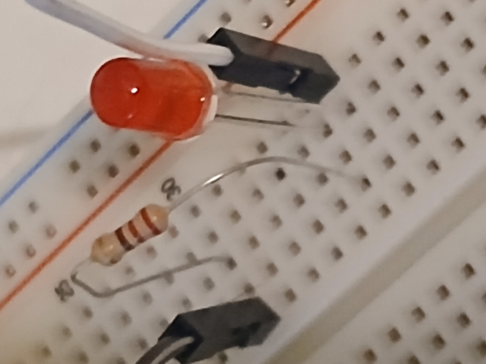

# Overview

This will help you with the LED wiring

# LED Wiring

You will need the following:

* 220-ohm resistor
* LED
* Two jumper wires (one black and one white, if you want to follow along with the colors) for this section.

<figure>
  
  <figcaption><em>Figure 4: 220 ohm resistor</em></figcaption>
</figure>

The white wire for the LED should be placed in __Row 7__, __Column H__ of the breadboard, which is connected to __GPIO 18__ on the Raspberry Pi.

<figure>
  
  <figcaption><em>Figure 5: White wire into row 7</em></figcaption>
</figure>

The black wire for the LED should be placed in __Row 4__, __Column H__ of the breadboard, which is connected to the __ground (GND)__ pin on the Raspberry Pi.

<figure>
  
  <figcaption><em>Figure 6: Black wire into row 4</em></figcaption>
</figure>

The LED should be placed so that the longer leg (anode) is in __Row 36__, __Column I__ and the shorter leg (cathode) is in __Row 35__, __Column I__.

The rest of the wiring should be done as follows:

* The white wire should connect to the longer leg (anode) in __Row 36__, __Column H__ from __Row 7__, __Column H__ (which we already connected).
* The 220-ohm resistor should connect from __Row 35__, __Column G__ to __Row 30__, __Column G__ 
* The black wire should connect go from __Row 30__, __Column F__ to __ground__ in __Row 4__, __Column H__ (which we already connected).

<figure>
  
  <figcaption><em>Figure 7: LED wiring</em></figcaption>
</figure>

<figure>
  
  <figcaption><em>Figure 8: Another angle of the LED wiring</em></figcaption>
</figure>