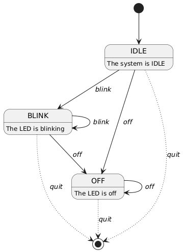
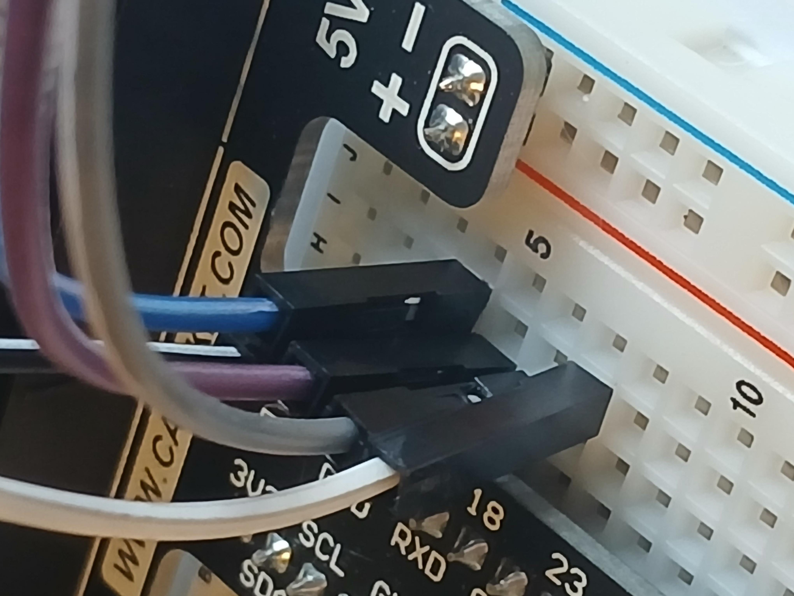
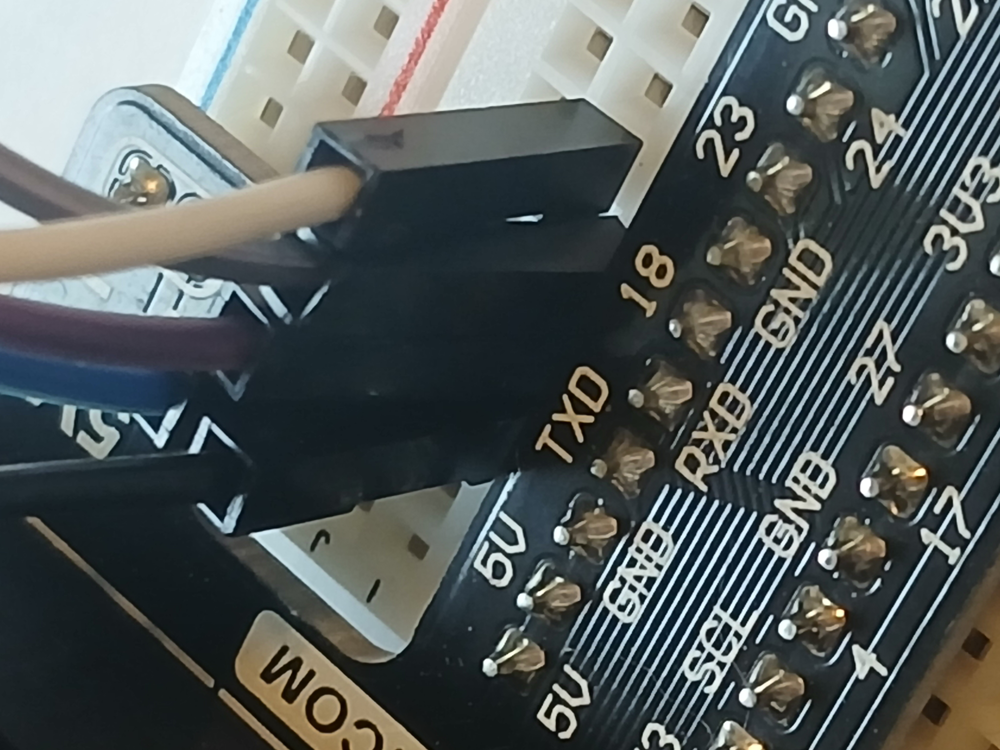
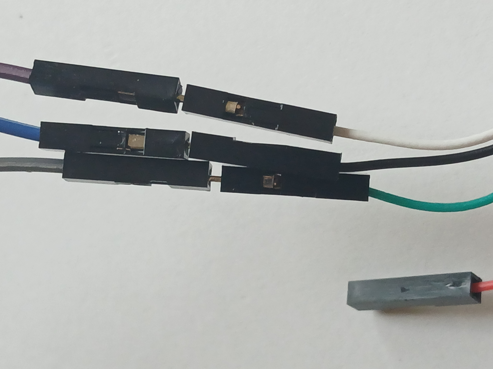

# Module 3

Explore the Universal Asynchronous Receiver/Transmitter (UART) 

## Overview

The `led_client.py` script can pass commands to the `led_server.py` script using UART communication. 

It accepts the following commands:
* `blink` - LED on the server side will blink on and off
* `off` - LED on the server side will turn off
* `quit` - Both the server and client will exit

Below is a PlantUML state diagram illustrating the states and transitions of the LED server.

```
@startuml

[*] --> IDLE

IDLE : The system is IDLE

IDLE --> BLINK : <i>blink</i>
IDLE -[dotted]-> [*] : <i>quit</i>
IDLE --> OFF: <i>off</i>

BLINK : The LED is blinking
BLINK --> BLINK: <i>blink</i>
BLINK --> OFF: <i>off</i>
BLINK -[dotted]-> [*]: <i>quit</i>

OFF: The LED is off
OFF --> OFF: <i>off</i>
OFF -[dotted]-> [*]: <i>quit</i>

@enduml
```

PlantUML will use the previous definition to generate the diagram.

I have used dotted lines to indicate transitions that lead to the termination of the program because it helps to visually 
separate those transitions from the more interesting states.

<figure>
  
  <figcaption><em>Figure 1: PlantUML Diagram of our state machine</em></figcaption>
</figure>

# Wiring the TTL-to-USB

The lab instructions should be sufficient for the wiring in 
this week's module.  However, here are some additional pictures just in case
you need them.

The purple wire is in __Row 5__ and connected to the TXD pin.

The gray wire is in __Row 6__ and connected to the RXD pin.

The blue wire is in __Row 4__ and connected to GND.

<figure>
  
  <figcaption><em>Figure 2: GPIO Angle 1</em></figcaption>
</figure>

<figure>
  
  <figcaption><em>Figure 3: GPIO Angle 2</em></figcaption>
</figure>

The purple wire (TXD pin) connects to the white wire

The gray wire (RXD pin) connects to the green wire

The blue wire (GND pin) connects to the black wire

We leave the red wire alone.

<figure>
  
  <figcaption><em>Figure 4: TTL Connection</em></figcaption>
</figure>
