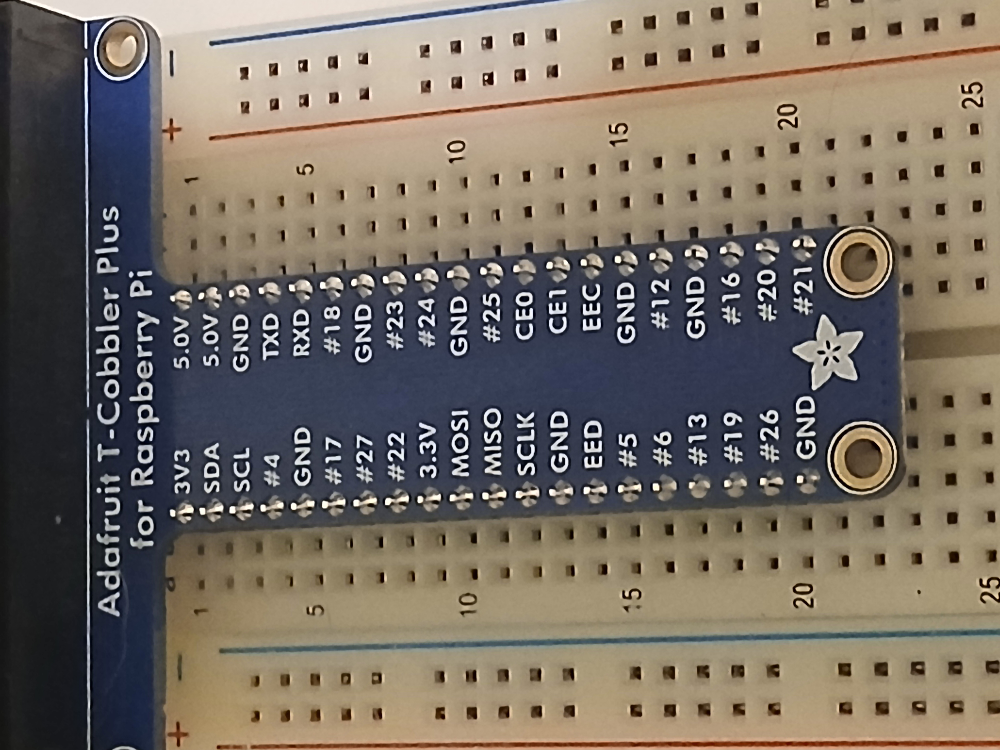
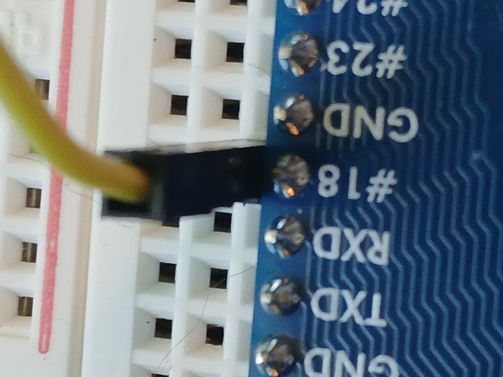
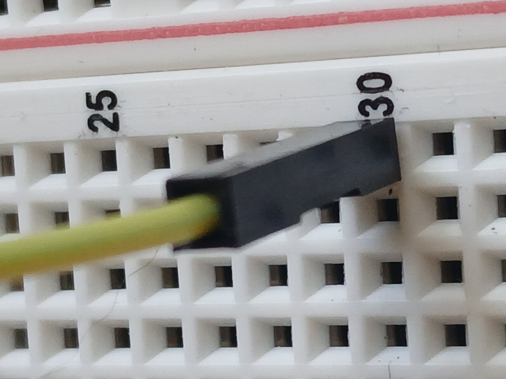
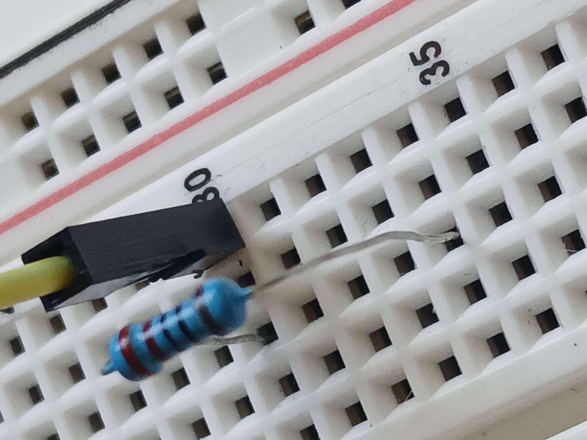
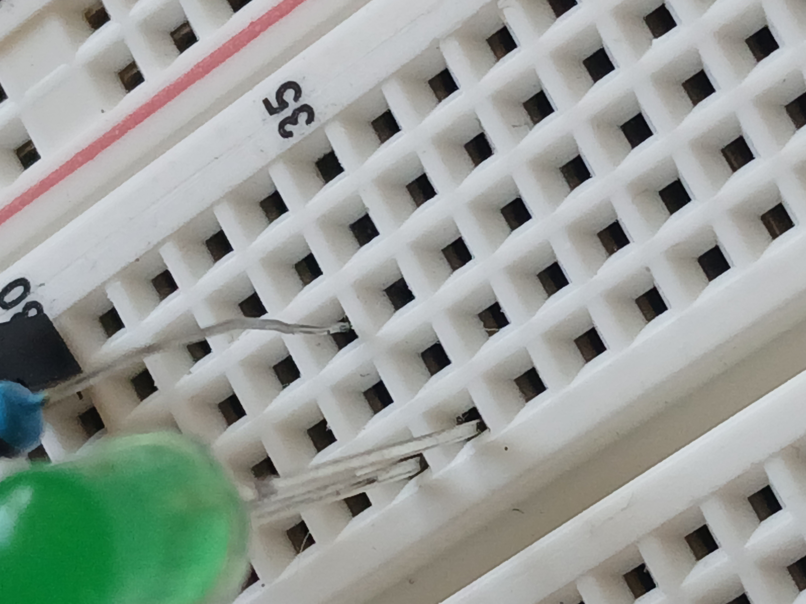
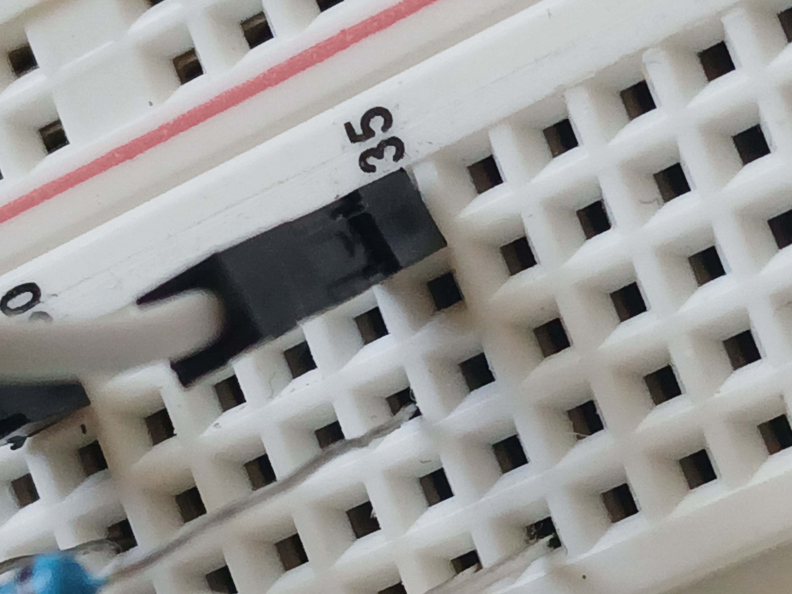
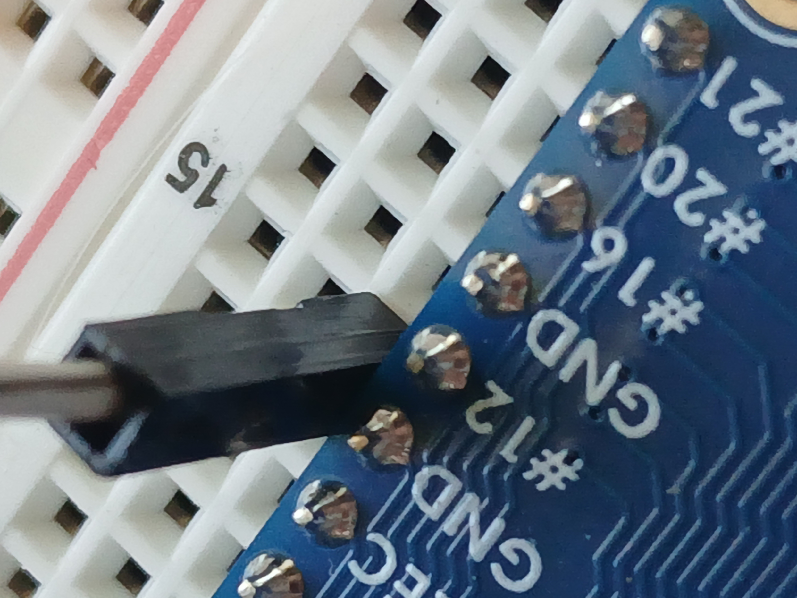

# Module 1: Initial Setup and wiring the green LED

# Introduction

This module focuses on the initial setup of the software environment and wiring the
green LED to the Raspberry Pi.

By the end of this module, you should have a working circuit with the green LED
wired to the Raspberry Pi and a script that can turn on the green LED when executed.

# Setup

First, we will install pip with the following command:
 
`sudo apt install python3-pip`

Then, we will install python-venv with the following command:

`sudo apt install python3-venv`

Then install the required cross-compilation tools with the following command:

`sudo apt-get install gcc-aarch64-linux-gnu`

Activate the virtual environment with the following command:

`source venv/bin/activate`

Then, we will install the `RPi` library with the following command:

`pip3 install python3-dev RPi.GPIO`

# Building the circuit

Place the breakout board on the breadboard as shown in the figure below.  The first pin is aligned with the first
row of the breadboard.

<figure>
  
  <figcaption><em>Figure 1: Breakout board placement</em></figcaption>
</figure>

Place the yellow wire in GPIO pin 18 (__Row 6__ and __Column H__ on the breadboard) as shown in the figure below.

<figure>
  
  <figcaption><em>Figure 2: Yellow wire to pin 18</em></figcaption>
</figure>

We then place the yellow wire from __Row 6__ and __Column H__ to __Row 30__ and __Column J__ as shown in the
figure below.

<figure>
  
  <figcaption><em>Figure 3: Yellow wire to pin 18</em></figcaption>
</figure>

The 220-ohm resistor

<figure>
  
  <figcaption><em>Figure 4: 220ohm resistor</em></figcaption>
</figure>

Place the 220-ohm resistor from __Row 30__ and __Column H__ to __Row 34__ and __Column H__ as shown in 
the figure below.

<figure>
  
  <figcaption><em>Figure 5: Resistor placement</em></figcaption>
</figure>

Place the green LED so that the longer leg (anode) is in __Row 34__ and __Column F__ and the shorter leg (cathode)
is in __Row 35__ and __Column F__ as shown in the figure below.

<figure>
  
  <figcaption><em>Figure 6: Green LED placement</em></figcaption>
</figure>

Place the white wire in __Row 35__ and __Column J__ as shown in the figure below.

<figure>
  
  <figcaption><em>Figure 7: White wire in Row 35</em></figcaption>
</figure>

Place the white wire from __Row 35__ and __Column J__ to the ground pin on the breakout board as shown in the
figure below.

<figure>
  
  <figcaption><em>Figure 8: White wire to ground (GND)</em></figcaption>
</figure>

# Testing the circuit

To test the circuit, we will use `led_tester.py` script. The script turns on any of our LEDs (we only have one for now) and then we
when we exit the program it cleans up the GPIO pins which turns the LED off.

To run the script, first activate the virtual environment with the following command:

`source venv/bin/activate`

Then, run the script with the following command:

`sudo python3 led_tester.py GREEN`

You should see the LED turn on. 

In the next [module](../module2/README.md) we will look at the initial coding of the 
state machine for the traffic light.

# Troubleshooting

Here are some common issues you might encounter and how to troubleshoot them.

## RuntimeError: No access to /dev/mem. Try running as root!

This error occurs when you try to run the script without root privileges. To fix this, you can run the script with `sudo` as shown in the testing section above.

## No LED is turning on

Ensure the circuit is correctly built according to the instructions.

Ensure you passed a parameter of GREEN, YELLOW, or RED to the script.  If you did not pass a parameter the script puts out a
usage message and exits without turning on any LEDs.

You should see the message:

`Usage: led_tester.py [GREEN|RED|YELLOW]`

Check to make sure teh LED is oriented correctly. The longer leg (anode) should be in Row 34 and Column F, and the 
shorter leg (cathode) should be in Row 35 and Column F.

