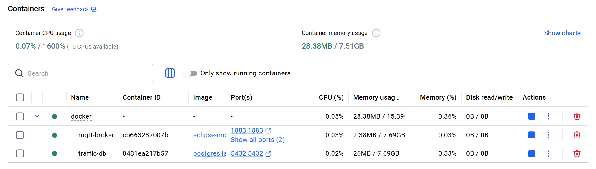

# Module 10 - Setting up a Postgres database

In this module we will be setting up a [Postgres](https://www.postgresql.org/) database to store our state data in.  
We'll be creating a service in Python that will subscribe to events and store them in the database for historical 
purposes.

## Postgres up and running

The first thing we'll do is update our Docker setup to include a Postgres database.

In our [docker-compose.yml](./docker/docker-compose.yml) file we add the following:

```dockerfile
  postgres:
    image: postgres:latest
    container_name: traffic-db
    environment:
      POSTGRES_DB: traffic_light
      POSTGRES_USER: postgres
      POSTGRES_PASSWORD: postgres
    ports:
      - "5432:5432"
    volumes:
      - postgres_data:/var/lib/postgresql
    restart: unless-stopped
```

Now we run our Docker setup by navigating to the [docker](./docker) folder and running the followoing command:

```shell
  docker compose up -d
```

The latest postgres at this time is Postgres 18.  We should see the containers up and running as shown in Figure 1 below

<figure>
  
  <figcaption><em>Figure 1: Docker Desktop running our containers</em></figcaption>
</figure>

## Where to store our data?

Now that our database is up and running, it would be nice if we had some data to go with it.

First, we need to create a table to store the data in.  To do that we add a script that will execute when the volume
is first mounted.  This is a great way to initialize the database as well as provide some initial data if necessary.
Under the volumes section, add the following

```dockerfile
- ./postgres:/docker-entrypoint-initdb.d
```

We will also create a [postgres](./docker/postgres) folder and add a [init.sql](./docker/postgres/init.sql) to it.

Our `init.sql` script will contain a command to create a table.  This is a very basic table, we are not considering 
different traffic light data coming in.  We can expand the database as the project becomes more complicated.

```sql
CREATE TABLE IF NOT EXISTS traffic_state_history (
    created_on TIMESTAMP NOT NULL DEFAULT NOW(),
    state      TEXT      NOT NULL
);
```

If our containers are running we will bring them down with the `-v` option to remove the volumes.

```shell
  docker compose down -v
```

When we start our containers, we should see a CREATE TABLE in the Postgres logs.  Even better we can run the following
command to show the table.

```shell
  docker exec traffic-db psql -U postgres -d traffic_light -c "\d traffic_state_history"
```

Which should display the following

```text
                   Table "public.traffic_state_history"
   Column   |            Type             | Collation | Nullable | Default
------------+-----------------------------+-----------+----------+---------
 created_on | timestamp without time zone |           | not null | now()
 state      | text                        |           | not null |
```

So, now we have a place for our data to be stored.

## Gathering our data

Now, we want to create a service to gather and store the data in the database.

This means we will be adding another container to our [docker-compose.yml](./docker/docker-compose.yml)

This is a little different than our previous entries because we are specifying a `build` script, and we are also using
`depends_on` to ensure that both the mosquitto (MQTT Broker) and postgres (SQL Database) are running.

```dockerfile
  mqtt-logger:
    build: ./mqtt_logger
    container_name: mqtt-logger
    environment:
      MQTT_HOST: mosquitto
      DB_HOST: postgres
      DB_NAME: traffic_light
      DB_USER: postgres
      DB_PASS: postgres
    depends_on:
      - mosquitto
      - postgres
    restart: unless-stopped
```

The [mqtt_logger](./docker/mqtt_logger) folder will need to contain the following:

* [Dockerfile](./docker/mqtt_logger) - The dockerfile will tell the system how to build the container
* [mqtt_logger.py](./docker/mqtt_logger) - The python program that will poll for data and write out events
* [requirements.txt](./docker/mqtt_logger) - A requirements file that we will to install any dependencies our python program has

### Creating the mqtt_logger

We want a program to gather any topics that come from the broker.

Define our imports, just as we saw from our updated [traffic_light_machine.py](../module9/traffic_light/traffic_light_machine.py) 
in Module 9 we are using the `paho.mqtt.client`.  

We also use `psycopg2` to interface with Postgres 

```python
import json
import time
import os
import psycopg2
import paho.mqtt.client as mqtt
```

We define some constants for interfacing with the MQTT Broker and the database..

```python
MQTT_HOST  = os.getenv("MQTT_HOST", "mosquitto")
MQTT_PORT  = int(os.getenv("MQTT_PORT", 1883))
MQTT_TOPIC = "traffic_light/state"

DB_HOST = os.getenv("DB_HOST", "postgres")
DB_PORT = int(os.getenv("DB_PORT", 5432))
DB_NAME = os.getenv("DB_NAME", "traffic_light")
DB_USER = os.getenv("DB_USER", "postgres")
DB_PASS = os.getenv("DB_PASS", "postgres")
```

Define a method to connect to the database 

```python
def connect_db():
    while True:
        try:
            conn = psycopg2.connect(
                host=DB_HOST, port=DB_PORT,
                dbname=DB_NAME, user=DB_USER, password=DB_PASS
            )
            conn.autocommit = True
            print("Connected to PostgreSQL")
            return conn
        except psycopg2.OperationalError as e:
            print(f"DB not ready, retrying in 2s: {e}")
            time.sleep(2)
```

Define an action for when the MQTT client is connected

```python
def on_connect(client, userdata, flags, reason_code, properties):
    print(f"Connected to MQTT broker (rc={reason_code})")
    client.subscribe(MQTT_TOPIC)
```

Define an action when we receive a message

```python
def on_message(client, userdata, msg):
    conn = userdata["conn"]
    try:
        payload = json.loads(msg.payload.decode())
        state = payload["state"]
        created_on = payload.get("timestamp")
        with conn.cursor() as cur:
            if created_on:
                cur.execute(
                    "INSERT INTO traffic_state_history (created_on, state) VALUES (%s, %s)",
                    (created_on, state)
                )
            else:
                cur.execute(
                    "INSERT INTO traffic_state_history (state) VALUES (%s)",
                    (state,)
                )
        print(f"Logged state: {state} at {created_on}")
    except Exception as e:
        print(f"Error storing message: {e}")
```

A main function to setup our client and have it run

```python
def main():
    conn = connect_db()

    client = mqtt.Client(mqtt.CallbackAPIVersion.VERSION2)
    client.user_data_set({"conn": conn})
    client.on_connect = on_connect
    client.on_message = on_message

    client.connect(MQTT_HOST, MQTT_PORT)
    client.loop_forever()


if __name__ == "__main__":
    main()
```

### Testing the MQTT logger

In order to test the infrastructure we have set up we can publish a test message

```shell
  docker exec mqtt-broker mosquitto_pub -h localhost -t traffic_light/state -m '{"timestamp": "2026-05-21T12:00:00", "state": "red"}'
```

Then we can check to see if the data is there

```shell
  docker exec traffic-db psql -U postgres -d traffic_light -c "SELECT * FROM traffic_state_history;"
```