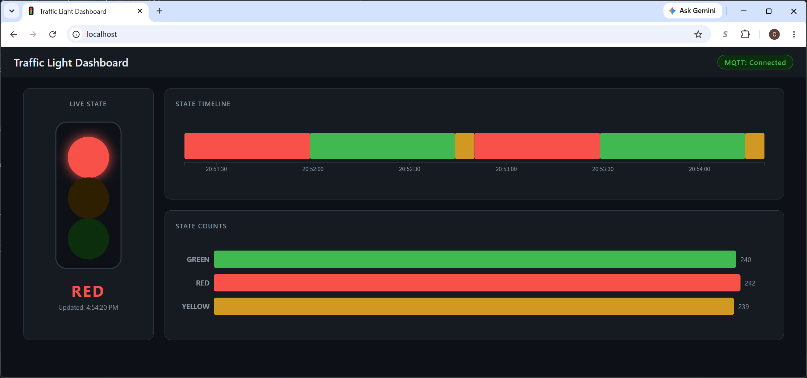

# Module 11 - Traffic Light Dashboard

## Setting up Docker

### Nginx Image

We use [Nginx](https://nginx.org/) to serve up our webpage.  Nginx is a free open-source HTTP web-server, according to
[W3techs.com](https://w3techs.com/technologies/details/ws-nginx) as of June 2026 it is used by 32.3% of webservers (
known to w3techs).

Below we setup the `docker-compose.yml` file for it

```dockerfile
  dashboard:
    image: nginx:alpine
    container_name: traffic-dashboard
    ports:
      - "80:80"
    volumes:
      - ./nginx/nginx.conf:/etc/nginx/conf.d/default.conf
      - ./dashboard:/usr/share/nginx/html
    depends_on:
      - api
      - mosquitto
    restart: unless-stopped
```

### Python API

We will be using [Flask](https://flask.palletsprojects.com/en/stable/) to power the APIs behind our project.  
Flask is a lightweight WSGI web application framework, which for us means we will be able to easily build out some 
[RESTful APIs](https://restfulapi.net/)

Below is the `docker-compose.yml` entry, we will define the `Dockerfile` next

```dockerfile
  api:
    build: ./api
    container_name: traffic-api
    environment:
      DB_HOST: postgres
      DB_NAME: traffic_light
      DB_USER: postgres
      DB_PASS: postgres
    depends_on:
      - postgres
    restart: unless-stopped
```

The `Dockerfile` is below

```dockerfile
FROM python:3.12-slim
ENV PYTHONUNBUFFERED=1
WORKDIR /app
COPY requirements.txt .
RUN pip install --no-cache-dir -r requirements.txt
COPY app.py .
CMD ["python", "app.py"]
```

Finally, the requirements that we need 

```text
flask
psycopg2-binary
```

### Docker build

Now that we have our containers defined, we can build them with

```shell
  docker compose up --build
```

## Dashboard

Because we are mounting a volume in our Nginx container with `./dashboard:/usr/share/nginx/html`, this means that we
do not need to constantly rebuild our container to see any changes.

Instead, after making changes to our dashboard we can do a reload with

```shell
  docker exec traffic-dashboard nginx -s reload
```

Let us take a look at our dashboard a little closer

### Dashboard CSS

We style our dashboard with Cascading Style Sheets, known as [CSS](https://developer.mozilla.org/en-US/docs/Web/CSS)

You can take a look at the [dashboard.css](docker/dashboard/css/dashboard.css) in detail, but here is a quick sample.

CSS lets us easily create reusable styles to use on our webpage.

```css
.card {
    background: #161b22;
    border: 1px solid #30363d;
    border-radius: 0.75rem;
    padding: 1.25rem;
}

.card-title {
    font-size: 0.75rem;
    font-weight: 600;
    text-transform: uppercase;
    letter-spacing: 0.08em;
    color: #8b949e;
    margin-bottom: 1rem;
}
```

We bring it into our HTML with a `link` element as shown below

```html
<head>
    <link rel="stylesheet" href="css/dashboard.css">
</head>
```

### D3.js

We use [D3.js](https://d3js.org/) to build our dashboard.  It is a powerful library for creating charts and graphs.

We bring in D3.js with the following `script` tag within the `body` of the HTML document.

Notice, that we are using an `integrity` attribute to the `script` tag.  This helps ensure that the imported Javascript
has not been tampered with.  You can use this [SRI generator](https://srihash.org/) to help you obtain the integrity hashes
if they are not provided for you.

```html
<script src="https://unpkg.com/d3@7.9.0/dist/d3.min.js" integrity="sha384-CjloA8y00+1SDAUkjs099PVfnY2KmDC2BZnws9kh8D/lX1s46w6EPhpXdqMfjK6i" crossorigin="anonymous"></script>
```

### MQTT Client

We bring in the [mqtt](https://github.com/mqttjs/mqtt.js/) package so that we can receive events from the traffic light. 

```html
<script src="https://unpkg.com/mqtt@5.15.1/dist/mqtt.min.js" integrity="sha384-yYo6Rf8oE1ymBEWidpn7Brg0E6BGJiencXj3K2GmcU9dlFZ1fIhEqimYrhQij0r0" crossorigin="anonymous"></script>
```

We connect to the MQTT broker with

```javascript
const mqttClient = mqtt.connect(`ws://${window.location.hostname}:9001`, {
    clientId: `dashboard_${Math.random().toString(16).slice(2, 8)}`,
    reconnectPeriod: 3000,
    connectTimeout: 5000,
});
```

Then we add code to process different events such as receiving a message

```javascript
mqttClient.on('message', (topic, msg) => {
    try {
        const { state, timestamp } = JSON.parse(msg.toString());
        const record = { state, timestamp: timestamp || new Date().toISOString() };

        historyData.push(record);
        if (historyData.length > 200) historyData.shift();

        setLight(state);
        renderTimeline();
        loadStats();
    } catch (e) {
        console.error('MQTT message error:', e);
    }
});
```

### Access Dashboard

With Docker up and running we can access the dashboard from [http://localhost](http://localhost) 

## Flask for the API

As we saw when setting up our containers we will be using Flask for our RESTful API handling.

Within the [app.py](./docker/api/app.py) we can define API endpoints with `@app.route` decorator as shown below

```python
@app.route('/stats')
```

The above route would define a route as `/api/stats`

A full example is below

```python
@app.route('/stats')
def stats():
    try:
        conn = get_conn()
        try:
            with conn.cursor() as cur:
                cur.execute(
                    'SELECT state, COUNT(*) FROM traffic_state_history GROUP BY state ORDER BY state'
                )
                rows = cur.fetchall()
        finally:
            conn.close()
        return jsonify([{'state': r[0], 'count': r[1]} for r in rows])
    except Exception as e:
        return jsonify({'error': str(e)}), 503
```

## Dashboard

With the project completed we have a dashboard that will update in real time thanks to
MQTT as our traffic light changes.

<figure>
  
  <figcaption><em>Figure 1: Traffic Light Dashboard</em></figcaption>
</figure>

# Conclusion

We have built out our [Minimum Viable Product (MVP)](https://www.atlassian.com/agile/product-management/minimum-viable-product).

In the final [module](../module12/README.md) we will look at some general improvements to the code and ideas
for enhancing the project that you can do on your own.
