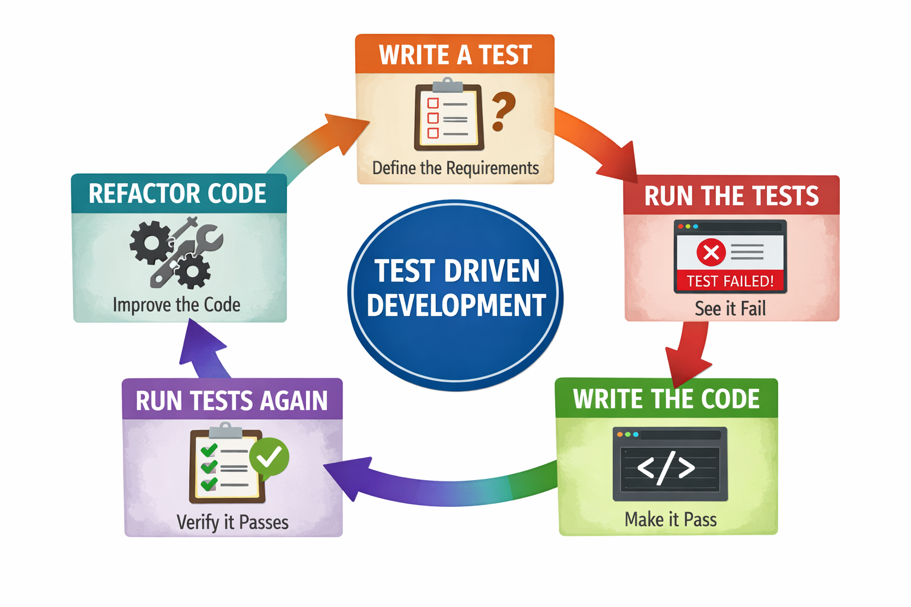

# Module 3: Testing

In this module we are going to take a look at how we might test both our program and our circuit.

Ideally, we would like to work in short development cycles of testing and coding.  Working towards a Test-Driven Development
approach, while we won't always present everything using that approach we do keep testing in mind as we are working.

So, what exactly is Test-Driven Development?

# Test-Driven Development

Test-Driven Development (TDD) is the process of writing unit tests first and then writing the code to make the unit
test pass.

The general idea is that testing our code typically comes after we write our code. However, we are never done with our 
code in time to write our tests, which leaves testing to be rushed at the end. 

With TDD we essentially make our tests just as important as writing the production code.  

The below infographic shows the basic flow.



## Using pytest

We will be __unit testing__ with [pytest](https://docs.pytest.org/en/stable/), this helps us create our tests and we
can look at automating our tests (an important part of testing) so that our tests can run as part of our workflow which
might be one or more of the following:

* When we make code changes
* When code is checked in
* As part of our Continuous Integration and Continuous Deployment (CI/CD) environment

## Restructuring our code

Let us refactor our code a little bit so that we can move forward with development more easily.

We do this by creating the following folder structure

```text
├── tests
└── traffic_light
    ├── __init__.py
    └── traffic_light_machine.py
```

By creating an empty `__init__.py` we are telling Python that this is a package. Which will help us import our state
machine into our tests later on.

The `tests` directory is where we will keep our test scripts.  Pytest will automatically look for a `tests` directory
and run anything it finds.

## Our first test

Remember that we have already created our state machine in the last module. So, we are not truly working using a "test first"
approach.  However, this gives us a good opportunity to look at how we create tests.

In our `tests` directory we will create `test_traffic_light_machine_simple.py` as shownn below

```text
├── tests
│   └── test_traffic_light_machine_simple.py
└── traffic_light
    ├── __init__.py
    └── traffic_light_machine.py
```

Here are the contents of our test script

```python
from traffic_light.traffic_light_machine import TrafficLightMachine


def test_traffic_light_cycles_between_green_and_yellow():
    sm = TrafficLightMachine()

    assert sm.green.is_active

    sm.cycle()
    assert sm.yellow.is_active

    sm.cycle()
    assert sm.green.is_active
```

This test helps confirm that:

1. When we create the state machine the default state is green, which we test using `assert sm.green_is_active`
2. After calling `sm.cycle()` the first time we are in the yellow state, which we test using `assert sm.yellow_is_active`
3. We call `sm.cycle()` again to move back to the green state, which we test using `assert sm.gree_is_active`

When we run `python3 -m pytest` we see the following output:

```text
============================= test session starts ==============================
platform linux -- Python 3.12.3, pytest-9.0.2, pluggy-1.6.0
rootdir: /home/admin/traffic_light/module3
collected 1 item

tests/test_traffic_light_machine_simple.py .                             [100%]

============================== 1 passed in 0.45s ===============================
```

We can see we passed our test. 

We might be asking ourselves, "So, what? I already knew it was working". Which is true, now let us take a look at
what happens when the code is not working.

To do this, we will simply change the `assert sm.yellow.is_active` to `assert sm.green.is_active` and rerun the test.

We now see that we failed our test and received a lot more output than we did previously.

```text
============================= test session starts ==============================
platform linux -- Python 3.12.3, pytest-9.0.2, pluggy-1.6.0
rootdir: /home/admin/traffic_light/module3
collected 1 item

tests/test_traffic_light_machine_simple.py F                             [100%]

=================================== FAILURES ===================================
______________ test_traffic_light_cycles_between_green_and_yellow ______________

    def test_traffic_light_cycles_between_green_and_yellow():
        sm = TrafficLightMachine()

        assert sm.green.is_active

        sm.cycle()
>       assert sm.green.is_active
E       AssertionError: assert False
E        +  where False = State('Green', id='green', value='green', initial=True, final=False, parallel=False).is_active
E        +    where State('Green', id='green', value='green', initial=True, final=False, parallel=False) = TrafficLightMachine(model=Model(state=yellow), state_field='state', configuration=['yellow']).green

tests/test_traffic_light_machine_simple.py:10: AssertionError
----------------------------- Captured stdout call -----------------------------
Green state entered.
Running cycle from green to yellow
Green state exited!
Yellow state entered.
=========================== short test summary info ============================
FAILED tests/test_traffic_light_machine_simple.py::test_traffic_light_cycles_between_green_and_yellow - AssertionError: assert False
============================== 1 failed in 0.81s ===============================
```

The important part is where we had an `Assertion Error`, we see that it was false as noted by `assert False` we also get 
additional information showing that the state is currently yellow as seen in the error message
`TrafficLightMachine(model=Model(state=yellow)...`

# Expanding our testing

We are not just limited to validating the objects. We can also test to ensure the log messages are populating as expected or just
to validate the code is working as expected.

As we previously saw when the test failed, we were provided with the captured standard output (stdout).

We can write a test that searches the standard output for a particular message.

The below test is from `test_traffic_light.py`

```python
def test_initial_state_is_green(capsys):
    sm = TrafficLightMachine()

    # StateChart activates the initial state on construction
    assert sm.green.is_active
    assert not sm.yellow.is_active

    # on_enter_green() should have printed during initialization
    captured = capsys.readouterr()
    assert "Green state entered." in captured.out
```

We are now test the following:

* The green state is active with `assert sm.green.is_active`
* The yellow state is not active with `assert not sm.yellow.is_active`
* That "Green state entered." is captured with `assert "Green state entered." in captured.out`

As you can begin to see, `pytest` provides a powerful way to test our code.

# Testing our circuit

We have seen how might go about testing our software with `pytest`, but what about how we can verify the circuit is 
correct?  

We have our `led_tester.py` script from Module 1, but it would also be nice to separate us having to write source code
to test our circuit.  Isn't there a command that we can run to do essentially what our code does?

We can use the [WiringPi](https://github.com/wiringpi/wiringpi) project to test our circuit.

We will get the project from GitHub and install it manually.

```bash
git clone https://github.com/WiringPi/WiringPi.git
cd WiringPi
./build
```

Once that completes, we should now have access to the `gpio` command. Note that you will have to use `sudo` to run the command.

## Testing the LED

Assuming we have setup our LED on GPIO pin 18, we can test it by running the following command

```bash 
sudo gpio -g mode 18 out
sudo gpio -g toggle 18
```

This will set GPIO pin 18 to output mode and toggle its state.  

If the LED is working correctly, it should light up when we run the toggle command. 
You can run the toggle command multiple times to see the LED turn on and off.

There is also a `sudo gpio readall`

Which produces output such as the below on my Raspberry Pi.

```text
 +-----+-----+---------+------+---+---Pi 3B--+---+------+---------+-----+-----+
 | BCM | wPi |   Name  | Mode | V | Physical | V | Mode | Name    | wPi | BCM |
 +-----+-----+---------+------+---+----++----+---+------+---------+-----+-----+
 |     |     |    3.3v |      |   |  1 || 2  |   |      | 5v      |     |     |
 |   2 |   8 |   SDA.1 | ALT0 | 1 |  3 || 4  |   |      | 5v      |     |     |
 |   3 |   9 |   SCL.1 | ALT0 | 1 |  5 || 6  |   |      | 0v      |     |     |
 |   4 |   7 | GPIO. 7 |   IN | 1 |  7 || 8  | 1 | ALT5 | TxD     | 15  | 14  |
 |     |     |      0v |      |   |  9 || 10 | 1 | ALT5 | RxD     | 16  | 15  |
 |  17 |   0 | GPIO. 0 |   IN | 0 | 11 || 12 | 0 | IN   | GPIO. 1 | 1   | 18  |
 |  27 |   2 | GPIO. 2 |   IN | 0 | 13 || 14 |   |      | 0v      |     |     |
 |  22 |   3 | GPIO. 3 |   IN | 0 | 15 || 16 | 0 | IN   | GPIO. 4 | 4   | 23  |
 |     |     |    3.3v |      |   | 17 || 18 | 0 | IN   | GPIO. 5 | 5   | 24  |
 |  10 |  12 |    MOSI | ALT0 | 0 | 19 || 20 |   |      | 0v      |     |     |
 |   9 |  13 |    MISO | ALT0 | 0 | 21 || 22 | 0 | IN   | GPIO. 6 | 6   | 25  |
 |  11 |  14 |    SCLK | ALT0 | 0 | 23 || 24 | 1 | OUT  | CE0     | 10  | 8   |
 |     |     |      0v |      |   | 25 || 26 | 1 | OUT  | CE1     | 11  | 7   |
 |   0 |  30 |   SDA.0 |   IN | 1 | 27 || 28 | 1 | IN   | SCL.0   | 31  | 1   |
 |   5 |  21 | GPIO.21 |   IN | 1 | 29 || 30 |   |      | 0v      |     |     |
 |   6 |  22 | GPIO.22 |   IN | 1 | 31 || 32 | 0 | IN   | GPIO.26 | 26  | 12  |
 |  13 |  23 | GPIO.23 |   IN | 0 | 33 || 34 |   |      | 0v      |     |     |
 |  19 |  24 | GPIO.24 |   IN | 0 | 35 || 36 | 0 | IN   | GPIO.27 | 27  | 16  |
 |  26 |  25 | GPIO.25 |   IN | 0 | 37 || 38 | 0 | IN   | GPIO.28 | 28  | 20  |
 |     |     |      0v |      |   | 39 || 40 | 0 | IN   | GPIO.29 | 29  | 21  |
 +-----+-----+---------+------+---+----++----+---+------+---------+-----+-----+
 | BCM | wPi |   Name  | Mode | V | Physical | V | Mode | Name    | wPi | BCM |
 +-----+-----+---------+------+---+---Pi 3B--+---+------+---------+-----+-----+
```

