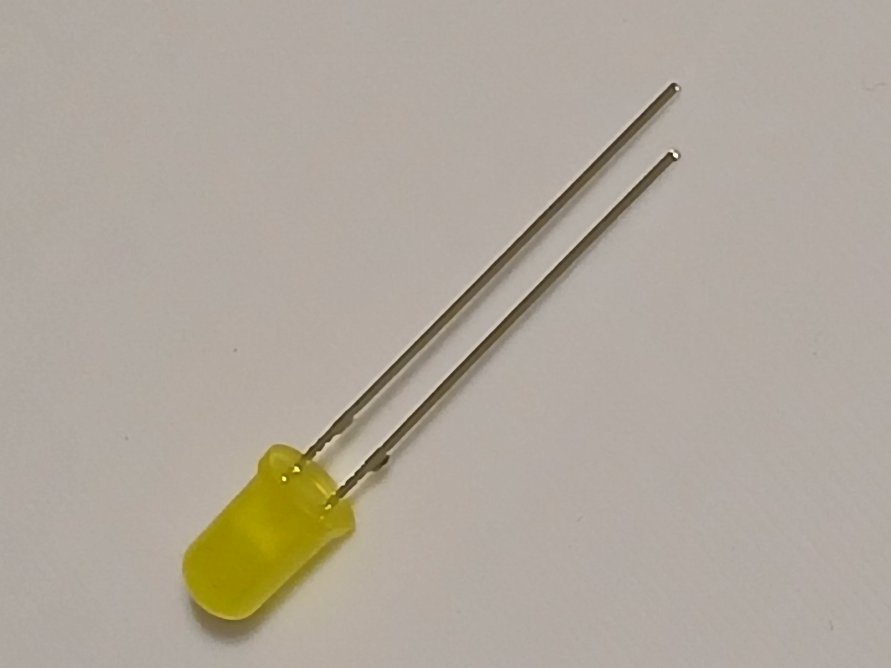
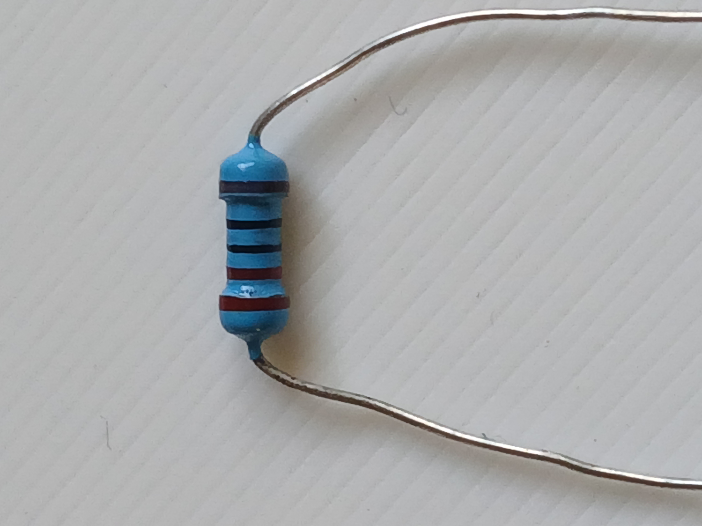
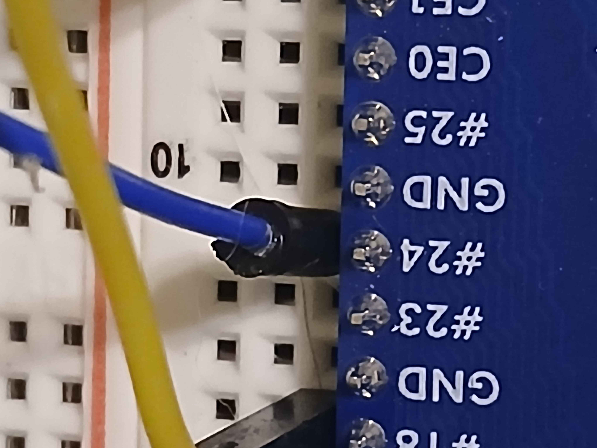
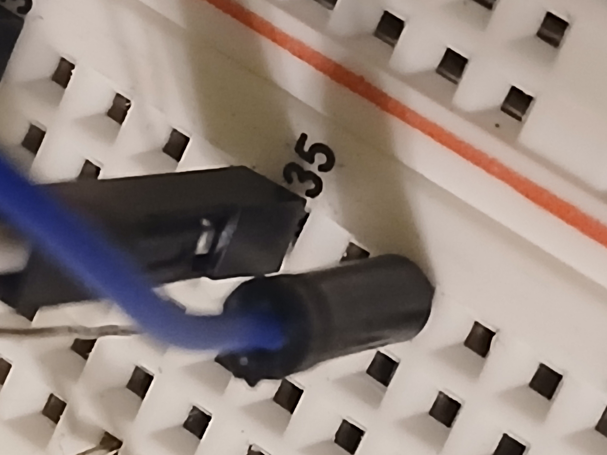
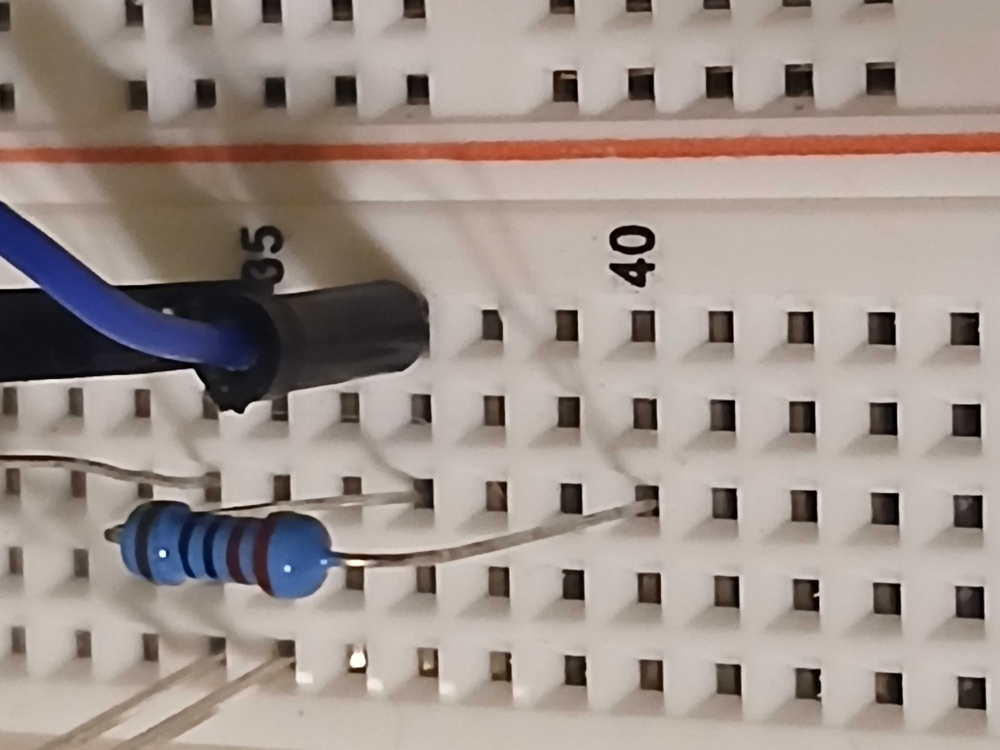
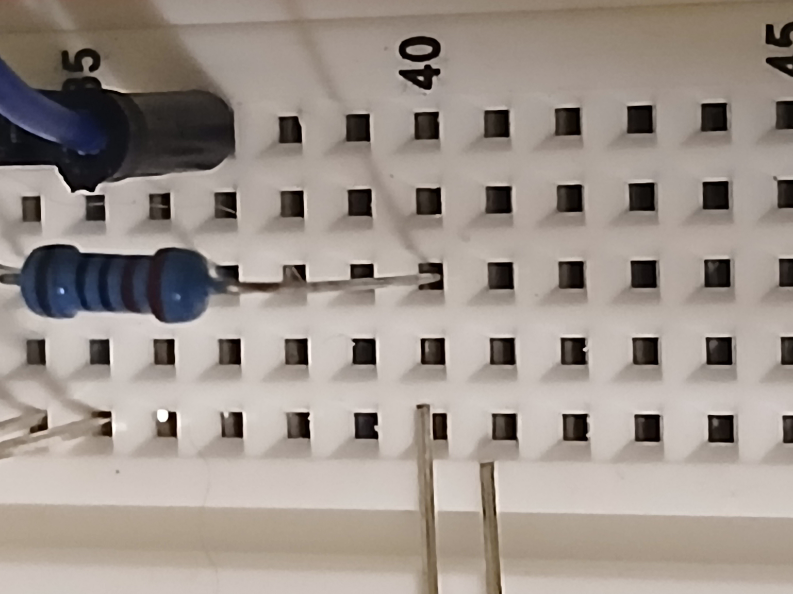
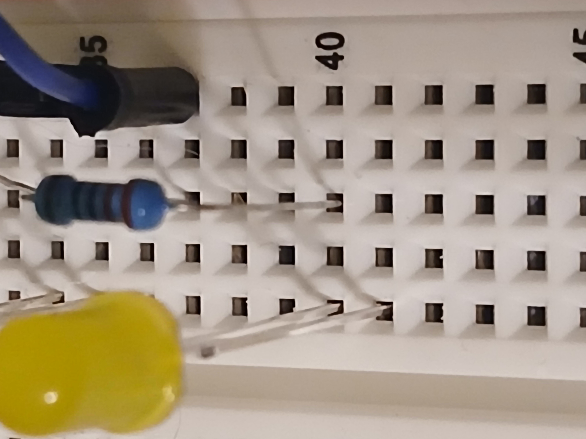
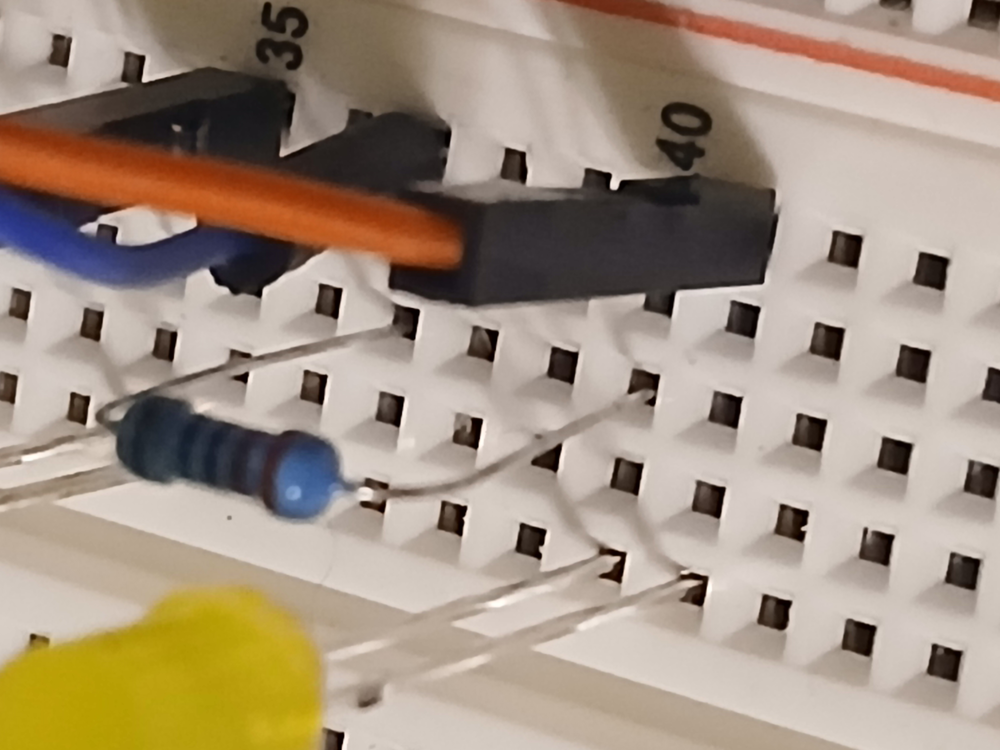
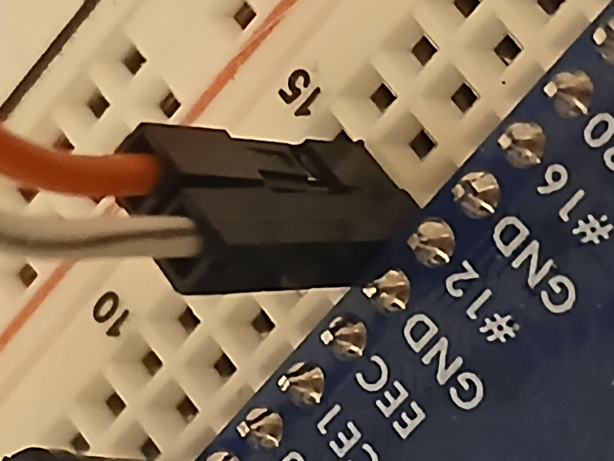

# Module 4: Adding the yellow LED

In this module we will wire up the yellow LED and test it.

# Wiring the Yellow LED

## Needed components

In addition to a couple wires, we will need our Yellow LED

<figure>
  
  <figcaption><em>Figure 1: Yellow LED</em></figcaption>
</figure>

And a 220-ohm resistor

<figure>
  
  <figcaption><em>Figure 2: 220-ohm resistor</em></figcaption>
</figure>

## Wiring

Remember that the colors of the wire do not matter, we mention them simply as a way to help you know which wire we
are referring to.

The blue wire goes to __Row 9, Column H__

<figure>
  
  <figcaption><em>Figure 3: Blue wire to pin 24</em></figcaption>
</figure>

We then wire the blue wire to __Row 37, Column J__

<figure>
  
  <figcaption><em>Figure 4: Blue wire to Row 37</em></figcaption>
</figure>

Place the 220-ohm resistor spanning __Row 37, Column G__ to __Row 40, Column G__

<figure>
  
  <figcaption><em>Figure 5: Resistor placement for yellow LED</em></figcaption>
</figure>

Figure 6 shows the legs of the LED, the longer leg (anode) is aligned to __Row 40, Column F__ and the shorter leg
(cathode) is aligned to __Row 41, Column F__

<figure>
  
  <figcaption><em>Figure 6: Notice the position of the LED, longer leg on Row 40</em></figcaption>
</figure>

Placing the yellow LED in __Row 40, Column F__ and __Row 40, Column F__

<figure>
  
  <figcaption><em>Figure 7: Yellow LED placement</em></figcaption>
</figure>

Place the orange wire in __Row 41, Column J__

<figure>
  
  <figcaption><em>Figure 8: Placing the orange wire</em></figcaption>
</figure>

Finally, the orange wire will go to GND on __Row 15, Row I__

<figure>
  
  <figcaption><em>Figure 9: Orange wire to GND</em></figcaption>
</figure>

With that our circuit should be complete, and we can move on to testing it.

# Testing the circuit

We can test the circuit by either running the `led_tester.py` we saw in Module 1 or by using the `gpio` command we 
had installed in `Module 3`

## Testing the green LED with led_tester.py

First, we will use the `led_tester.py` program.  Go back to the Module 1 directory and activate the environment with

`source venv/bin/activate`

Then run

`sudo python3 led_tester.py GREEN`

And you should see

`GREEN LED ON (pin 18). Press Ctrl+C to exit.`

More importantly than the above message, you should see the green LED light up.  This shouldn't be unexpected because
it was working previously, at this point we are just making sure we did not mess something up.

After exiting the program with `Ctrl+C` we then test it with gpio.

## Testing the green LED with gpio

From the command line we set pin 18 to output

`sudo gpio -g mode 18 out`

If we then run `sudo gpio readall` we will see the below (output trimmed to make it easier to read)

```text
 +-----+-----+---------+------+---+---Pi 3B--+---+------+---------+-----+-----+
 | BCM | wPi |   Name  | Mode | V | Physical | V | Mode | Name    | wPi | BCM |
 +-----+-----+---------+------+---+----++----+---+------+---------+-----+-----+
                                       || 12 | 0 | OUT  | GPIO. 1 | 1   | 18  |
```

We see that BCM number 18 (the GPIO pin we have the green LED on) now has a mode of `OUT`, also note the `V` column has
a value of 0 indicating there is no voltage on the pin.

We can toggle the pin with

`sudo gpio -g toggle 18`

This will turn on the pin, which in turn lights the green LED.

Now, if we run `sudo gpio readall` we will see 

```text
 +-----+-----+---------+------+---+---Pi 3B--+---+------+---------+-----+-----+
 | BCM | wPi |   Name  | Mode | V | Physical | V | Mode | Name    | wPi | BCM |
 +-----+-----+---------+------+---+----++----+---+------+---------+-----+-----+
                                       || 12 | 1 | OUT  | GPIO. 1 | 1   | 18  |
```

We see that `V` has now changed to `1` indicating that the pin is on.

## Making gpio output a little more readable

So, that it is easier to read the `gpio` output, I have wrapped the `gpio` command in a shell script that provides
single pin output.

If you run `gpio-pininfo.sh 18` you will see:

```text
GPIO Diagnostic
---------------------------
BCM Pin:       18
wPi Pin:       1
Physical Pin:  12
Name:          GPIO. 1
Mode:          OUT
Value:         HIGH (1)
```

It is all the same information from the `gpio` command but might be easier to read until you gain a better understanding
of looking at the `gpio readall` output.

## Testing the yellow pin

To test the yellow LED, the steps are the same as when we verified the green LED above.  So, we just run through them
quickly here.

Testing with the `led_tester.py` program, we run `sudo python3 led_tester.py YELLOW` and should see
`YELLOW LED ON (pin 24). Press Ctrl+C to exit.`

Or use the `gpio` command to set the mode of pin 24 to OUT

`sudo gpio -g mode 24 out`

And then toggle the LED on and off with `sudo gpio -g toggle 24`

Verify the LED turns on and off as expected.

Use the `sudo gpio readall` to verify the pin if needed.

```text
 +-----+-----+---------+------+---+---Pi 3B--+---+------+---------+-----+-----+
 | BCM | wPi |   Name  | Mode | V | Physical | V | Mode | Name    | wPi | BCM |
 +-----+-----+---------+------+---+----++----+---+------+---------+-----+-----+
                                       || 18 | 1 | OUT  | GPIO. 5 | 5   | 24  |
 ```

Note that `BCM` shows 24 (the pin the yellow LED is connected to) and that the `Mode` is `OUT` and `V` is `1` so the
LED should be on.

Or finally, use the wrapper to verify the LED is on `sudo ./gpio-pininfo.sh 24`

```text
GPIO Diagnostic
---------------------------
BCM Pin:       24
wPi Pin:       5
Physical Pin:  18
Name:          GPIO. 5
Mode:          OUT
Value:         HIGH (1)
```

Then toggle the LED off with `sudo gpio -g toggle 24`

And then verify it is off with `sudo ./gpio-pininfo.sh 24`

```text
GPIO Diagnostic
---------------------------
BCM Pin:       24
wPi Pin:       5
Physical Pin:  18
Name:          GPIO. 5
Mode:          OUT
Value:         LOW (0)
```

# Wrap up

We now have the yellow LED working and in the next [module](../module5/README.md) we will connect the red LED so that we can start coding and
exploring our traffic light.


