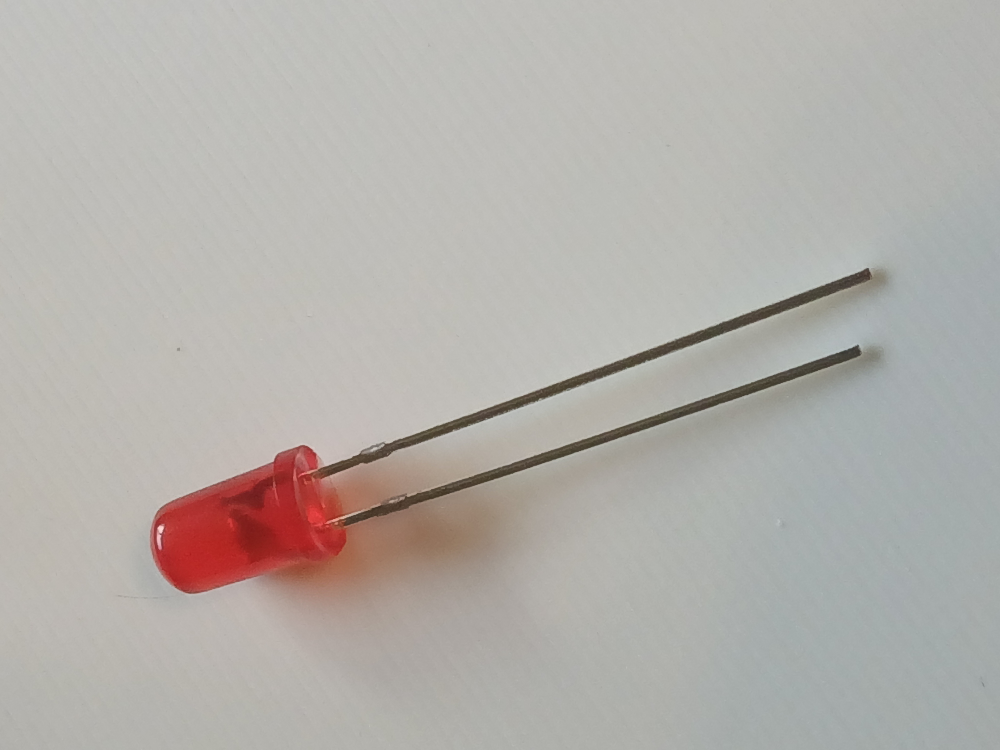
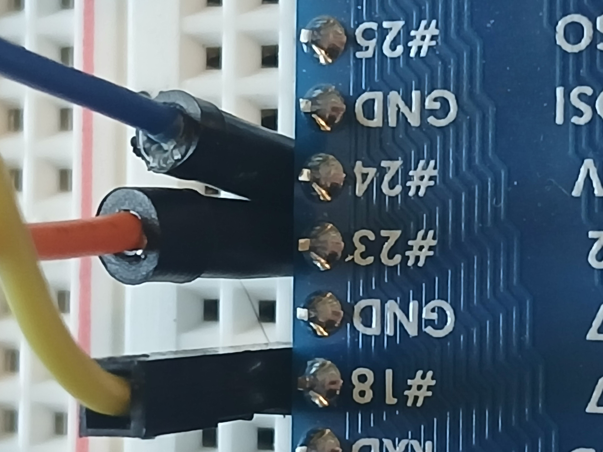
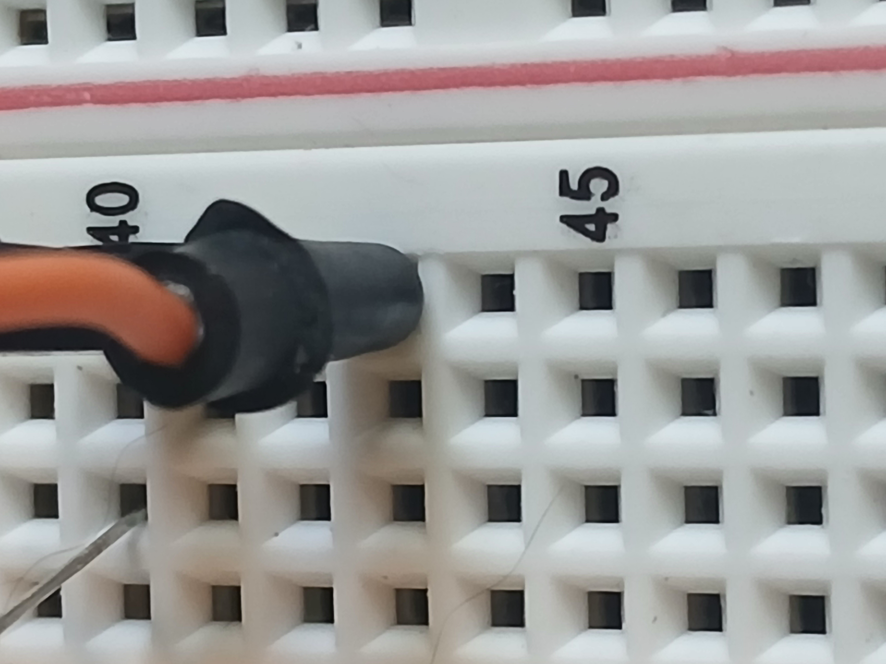
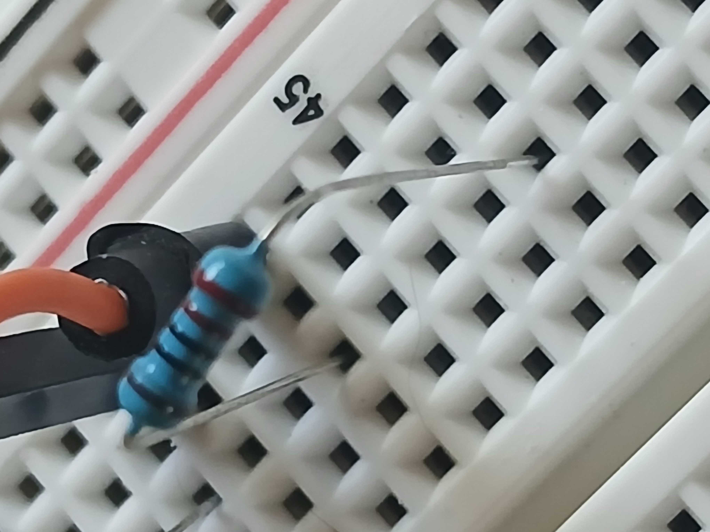
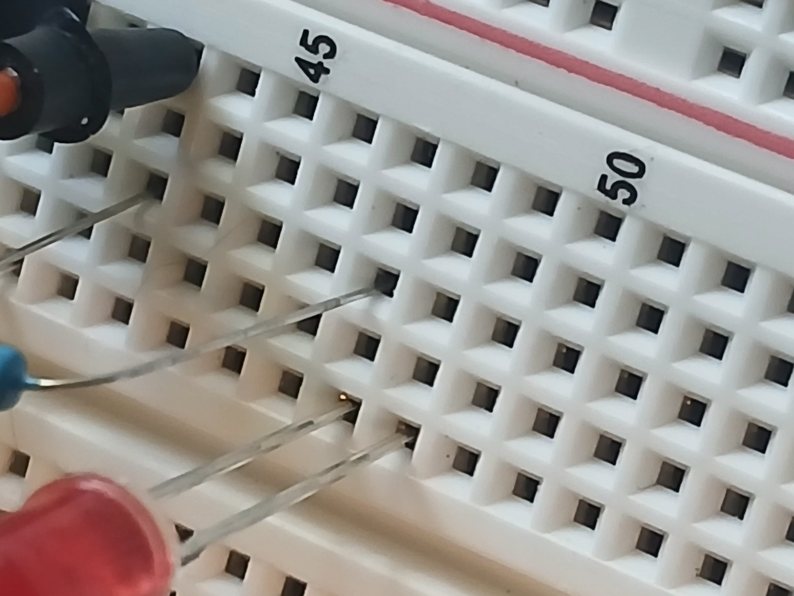
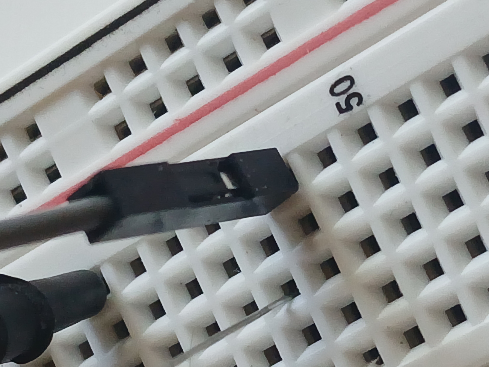
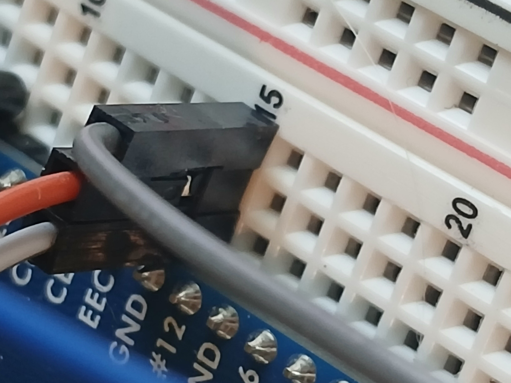
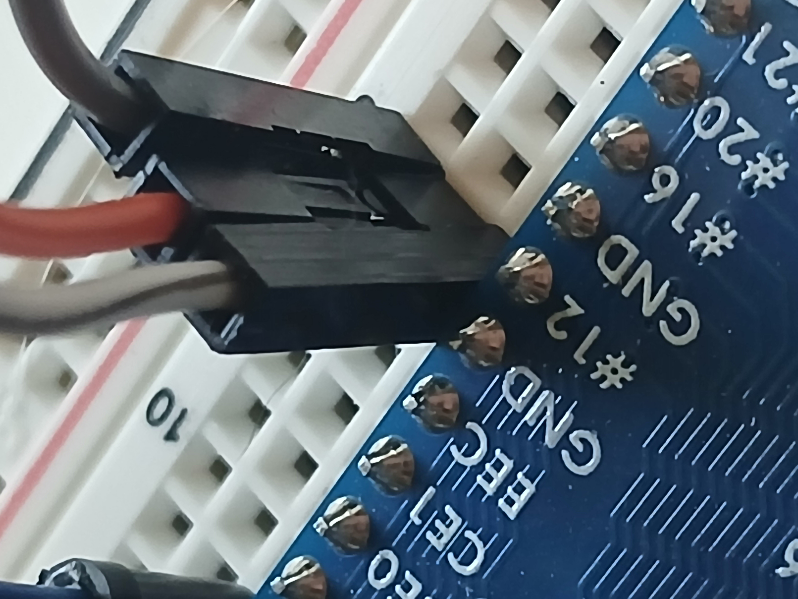

# Module 5: Adding the Red LED

This module is similar to the previous module. We will be wiring up the red LED and testing it.

# Wiring the red LED

## Needed components

Again, in addition to a couple of wires, we will need a red LED

<figure>
  
  <figcaption><em>Figure 1: Red LED</em></figcaption>
</figure>

And a 220-ohm resistor

<figure>
  
  <figcaption><em>Figure 2: 220-ohm resistor</em></figcaption>
</figure>

## Wiring

Again, the colors of the wire do not matter, we only mention them as a matter of
additional reference.

We are using an orange wire to Pin 23 in __Row 8, Column H__

<figure>
  
  <figcaption><em>Figure 3: Orange wire to GPIO Pin 23</em></figcaption>
</figure>

Connect the orange wire to __Row 43, Column J__

<figure>
  
  <figcaption><em>Figure 4: Orange wire to row 43</em></figcaption>
</figure>

We place the resistor in __Row 43, Column H__ and over to __Row 47, Column H__

<figure>
  
  <figcaption><em>Figure 5: Resistor placement</em></figcaption>
</figure>

The red LED goes from __Row 47, Column F__ to __Row 48, Column F__

<figure>
  
  <figcaption><em>Figure 6: Red LED placement</em></figcaption>
</figure>

Connect the gray wire __Row 48, Column J__

<figure>
  
  <figcaption><em>Figure 7: Place the gray wire</em></figcaption>
</figure>

Ground the gray wire in __Row 15, Column J__

<figure>
  
  <figcaption><em>Figure 8: Grounding the gray wire, angle 1</em></figcaption>
</figure>

Another angle of the gray wire connected to GND

<figure>
  
  <figcaption><em>Figure 9: Gray wire, angle 2</em></figcaption>
</figure>
