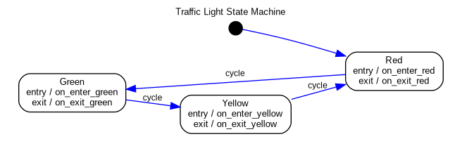
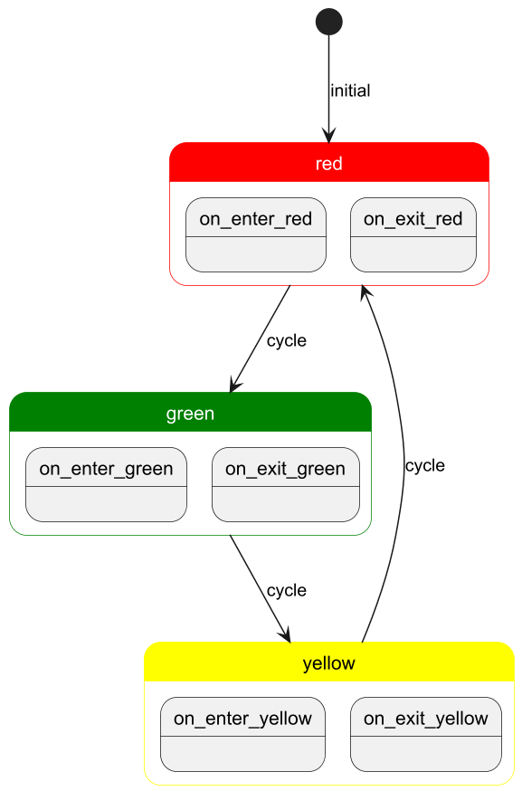
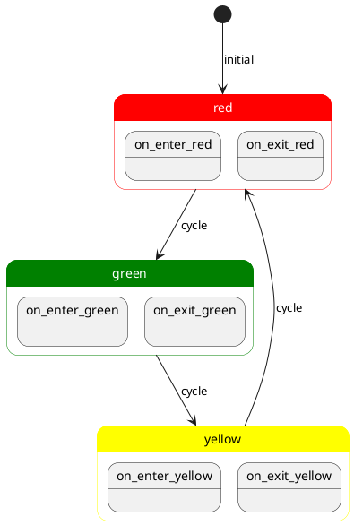
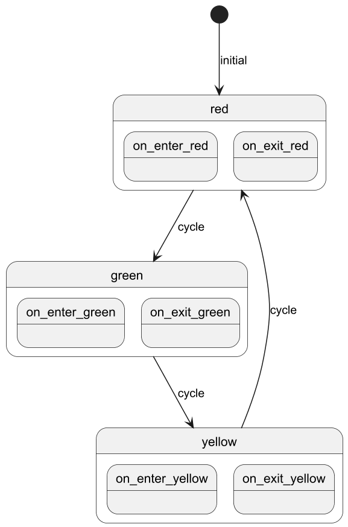

# Module 7: State Diagrams

We now have a functioning circuit and state machine.

We are going to take a moment to look at how we might document our system using a state diagram.

To get started, install the following package 

`sudo apt install graphviz`

# What is a state diagram

A state machine diagram is a visual representation of how a system moves between different states in response to events
or conditions.

# Creating a state machine diagram from the code

## Code changes

We will add an optional argument to `traffic_light.py` which will produce a state diagram for us.

First we update the main function and import `argparse`

```python
import argparse
```

Then we add an argument of `diagram` with the current directory (`.`) a s constant if nothing is passed along with `--diagram`
to specify an output directory.

If we found a diagram argument then we will call a generate diagram routine and return.

```python
def main() -> None:
    parser = argparse.ArgumentParser(description="Traffic Light State Machine")
    parser.add_argument(
        "--diagram",
        nargs="?",
        const=".",
        metavar="OUTPUT_PATH",
        help="Generate a state diagram PNG (default output is : CURRENT_DIRECTORY/traffic_light_diagram.png)",
    )
    args = parser.parse_args()

    if args.diagram is not None:
        generate_diagram(args.diagram)
        return

    sm = TrafficLightMachine()
    try:
        while True:
            sm.send("cycle")
            sm.send("cycle")
            sm.send("cycle")
    except KeyboardInterrupt:
        pass
    finally:
        print("\nExiting...")
```

Then we import `DotGraphMachine`

```python
from statemachine.contrib.diagram import DotGraphMachine
```

And add the following code for `generate_diagram`

We can see that we create a `graph` object with `DotGraphMachine(TrafficLightMachine)`.  We are passing our 
TrafficLightMachine class as a parameter which will be used to create the graph.

The graph is created as a PNG file since we are using the `write_png` method.

```python
def generate_diagram(output_path: str) -> None:
    try:
        graph = DotGraphMachine(TrafficLightMachine)
        dot = graph()
        dot.set_label("Traffic Light State Machine")
        dot.set_labelloc("t")
        dot.write_png(output_path + "/traffic_light_diagram.png")
        print(f"State diagram saved to {output_path}/traffic_light_diagram.png")
    except ImportError:
        print("Error: 'graphviz' package is required. Install it with: pip install graphviz")
        raise
```

## Producing the diagram

Now that we have setup our code, we can run our program with

`sudo ./.venv/bin/python3 traffic_light.py --diagram`

Which produces the `traffic_light_diagram.png` in the current directory, you can see the diagram in Figure 1 below

<figure>
  
  <figcaption><em>Figure 1: State machine diagram</em></figcaption>
</figure>

## Producing the diagram with PlantUML

You likely have projects that may have used state machines or a similar concept but did not have the convenience of
being able to directly generate a diagram as we did above.

There are a number of tools that you can use to create diagrams.  Here we will show [PlantUML](https://plantuml.com/) a
personal favorite for creating diagrams.

We create the below state diagram in Figure 2.

<figure>
  
  <figcaption><em>Figure 2: State machine diagram created with PlantUML</em></figcaption>
</figure>

Which was created with the below code (included in `traffic_light_diagram.puml`).



You can see that we used `skinparam` to make the diagram a little fancier.  However, we could have left that out and 
only used the states and transitions to come up with a less flashy diagram as shown in Figure 3.

<figure>
  
  <figcaption><em>Figure 3: Simple state machine diagram created with PlantUML</em></figcaption>
</figure>

# Conclusion

That is a quick introduction to state machine diagrams and PlantUML.

In the next [module](../module7/README.md) we will have an introduction to Docker.