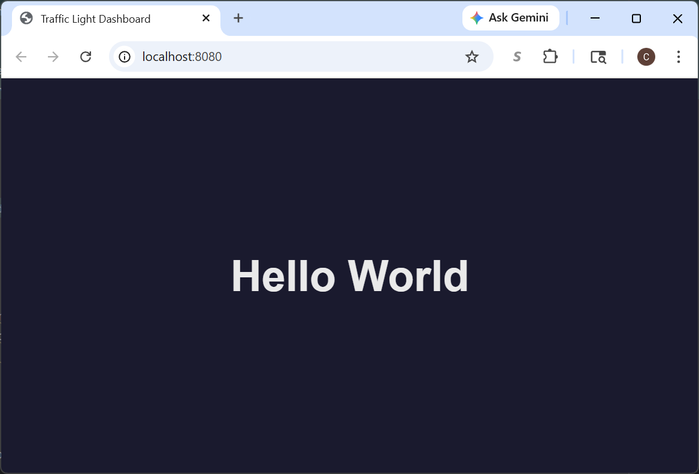
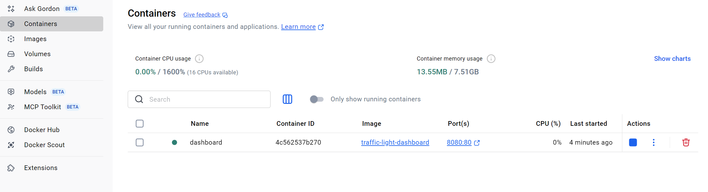

# Module 8: Introduction to Docker

Docker is a platform that packages an application and everything it needs to run
(code, runtime, libraries, configuration) into a portable unit called a **container**.
Containers run the same way on any machine that has Docker installed, eliminating the
classic "it works on my machine" problem.

It is also convenient for developers because we can try out languages, frameworks, and tools without having to clutter
up our computers.  Everything exists in a Docker Image, we try something out and then delete it.  Nothing left hanging
around on our computer.

## Key Concepts

Here are some terms that are helpful when working with Docker.

| Term | Description |
|------|-------------|
| **Image** | A read-only blueprint for a container (like a class in OOP) |
| **Container** | A running instance of an image (like an object) |
| **Dockerfile** | A text file with instructions for building an image |
| **Registry** | A repository for storing and sharing images (e.g., Docker Hub) |

## Project Structure

Module 8 adds the Docker file and we will initially be setting up a simple web page that we can navigate to.  Later
this page will become a dashboard which we can view data that we receive from the traffic light.  For the time being,
it is a simple "Hello World" page.

```
module8/
├── Dockerfile        # Instructions to build the image
└── html/
    └── index.html    # Web page served by the container
```

## The Dockerfile Explained

```dockerfile
FROM nginx:alpine       # Start from the official nginx image (Alpine = small Linux)
COPY html/ /usr/share/nginx/html/   # Copy our HTML into the web server's root
EXPOSE 80               # Document that the container listens on port 80
```

`nginx` is a production-grade web server used by a thrid of all websites.
The `alpine` variant is based on Alpine Linux, keeping the image under 15 MB.

## Build the Image

From the `module8/` directory, run:

```bash
docker build -t traffic-light-dashboard .
```

- `-t traffic-light-dashboard` — gives the image a name (tag)
- `.` — tells Docker to look for the `Dockerfile` in the current directory

You will see output similar to the following, as Docker donwloads the needed images and builds the container

```text
[+] Building 14.5s (7/7) FINISHED                                                                                                                                                                                                                                                              docker:desktop-linux
 => [internal] load build definition from Dockerfile                                                                                                                                                                                                                                                           0.0s
 => => transferring dockerfile: 283B                                                                                                                                                                                                                                                                           0.0s
 => [internal] load metadata for docker.io/library/nginx:alpine                                                                                                                                                                                                                                                3.5s
 => [internal] load .dockerignore                                                                                                                                                                                                                                                                              0.0s
 => => transferring context: 2B                                                                                                                                                                                                                                                                                0.0s
 => [internal] load build context                                                                                                                                                                                                                                                                              0.0s
 => => transferring context: 672B                                                                                                                                                                                                                                                                              0.0s
 => [1/2] FROM docker.io/library/nginx:alpine@sha256:5616878291a2eed594aee8db4dade5878cf7edcb475e59193904b198d9b830de                                                                                                                                                                                         10.2s
 => => resolve docker.io/library/nginx:alpine@sha256:5616878291a2eed594aee8db4dade5878cf7edcb475e59193904b198d9b830de                                                                                                                                                                                          0.0s
 => => sha256:82736a35d0e7f1309edc13d09115410b81542cf8b91afff80deeace02b6f2f26 1.87MB / 1.87MB                                                                                                                                                                                                                 4.5s
 => => sha256:3bcf852aed06467cf075c6105892e4d5a6ebbbafa0ce22d35062db9e90ddef4c 2.50kB / 2.50kB                                                                                                                                                                                                                 0.0s
 => => extracting sha256:612c0c1df4c55a0bf145f84df03cb28de505e6a52fb8e49c9da7b143fc00ad2d                                                                                                                                                                                                                      0.5s 
 => [2/2] COPY html/ /usr/share/nginx/html/                                                                                                                                                                                                                                                                    0.6s 
 => exporting to image                                                                                                                                                                                                                                                                                         0.0s 
 => => exporting layers                                                                                                                                                                                                                                                                                        0.0s 
 => => writing image sha256:a6e0ee053989fc8b4ad1afee9d121627e42c0c4e61d1b293d8db36c27357d2dd                                                                                                                                                                                                                   0.0s 
 => => naming to docker.io/library/traffic-light-dashboard                                                                                                                                                                                                                                                     0.0s 
```

## Run the Container

```bash
docker run -d -p 8080:80 --name dashboard traffic-light-dashboard
```

| Flag | Meaning |
|------|---------|
| `-d` | Run in detached (background) mode |
| `-p 8080:80` | Map port 8080 on your machine to port 80 inside the container |
| `--name dashboard` | Give the container a friendly name |

Open your browser and navigate to **http://localhost:8080** — you should see "Hello World".  As shown below in Figure 1.

<figure>
  
  <figcaption><em>Figure 1: Hello World Webpage</em></figcaption>
</figure>


## Useful Docker Commands

Here are some useful dashboard commands

```bash
# List running containers
docker ps

# Stop the container
docker stop dashboard

# Remove the container
docker rm dashboard

# List all images
docker images

# Remove the image
docker rmi traffic-light-dashboard
```

If the command line isn't your thing, then you can also use Docker Desktop as shown in Figure 2.

<figure>
  
  <figcaption><em>Figure 2: Docker Desktop</em></figcaption>
</figure>


## What's Next

In the later modules we will replace the "Hello World" page with a live
[d3.js](https://d3js.org/) dashboard that visualizes traffic light state data.

First, we will work on moving data from our Raspberry Pi to the server by using MQTT.

# Troubleshooting

## Error - ERROR: error during connect

If you receive this error
`ERROR: error during connect: Head "http://%2F%2F.%2Fpipe%2FdockerDesktopLinuxEngine/_ping": open //./pipe/dockerDesktopLinuxEngine: The system cannot find the file specified.`

### Solution

Ensure Docker is running

# Conclusion

That was a quick introduction to Docker. You built an image from a Dockerfile,
ran it as a container, and served a web page — all without installing nginx directly
on your machine.

In the next [module](../module9/README.md) we will leverage Docker to add MQTT to our project.
