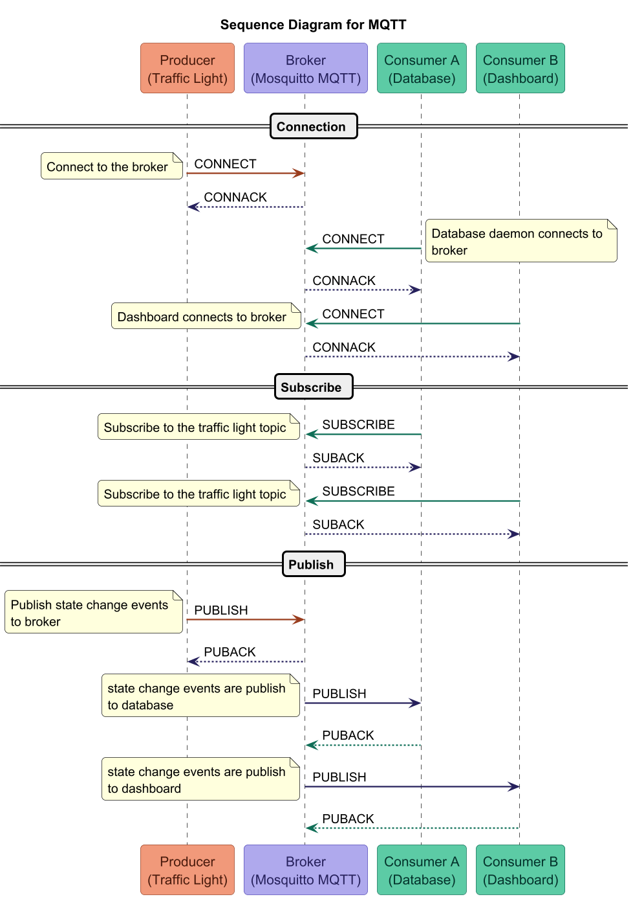

# Module 9: Using MQTT

In this module we integrate MQTT into the traffic light state machine. Each time the
light enters a new state, it publishes a JSON message to an MQTT broker running in
Docker. This decouples the hardware controller from any downstream consumers
(dashboards, loggers, other services) — they subscribe to the broker topic and receive
state changes without needing to know anything about the traffic light itself.

## Prerequisites

* Docker and Docker Compose installed
* Python dependencies installed: `pip install -r requirements.txt`
  * `paho-mqtt` has been added to `requirements.txt` for the MQTT client library
* The `mosquitto-clients` command line interface (CLI)
  * Installed with `sudo apt install mosquitto_clients`

## Running the MQTT Broker

The broker is a [Mosquitto](https://mosquitto.org/) container defined in
`docker/docker-compose.yml`. From the `docker/` directory we run the following to start the container

```bash
docker compose up -d
```

This starts Mosquitto in the background and exposes two ports:

| Port | Protocol             | Purpose                             |
|------|----------------------|-------------------------------------|
| 1883 | MQTT (TCP)           | Python client connections           |
| 9001 | MQTT over WebSockets | Browser-based clients / dashboards  |

To stop the MQTT broker:

```bash
docker compose down
```

To watch broker logs in real time:

```bash
docker compose logs -f
```

## Publishing and Subscribing to messages from MQTT

We can ensure everything is working by having two terminal sessions open, running the consumer in one window, and the
producer in another.

Running the following command, creates a consumer subscribed to the `test/topic`

```shell
mosquitto_sub -h 192.168.4.34 -p 1883 -t "test/topic" -v
```

* -h specifies the host
* -p specifies the port
* -t specifies the topic
* -v specifies verbose

In another window, we can publish a message with 

```shell
mosquitto_pub -h 192.168.4.34 -p 1883 -t "test/topic" -m "hello from pi"
```

The options are the same as above, except that we replaced `-v` with `-m "hello from pi"`

When you run the above command you will see the text `hello from pi` appear in the subscriber windows.

With that in place and working, we can now focus on updating the `traffic_light_machine` to publish message.

## Publishing Traffic Light Messages

First, let us import the `mqtt` client into our `traffic_light_machine` by adding the line

```python
import paho.mqtt.client as mqtt
```

Then we define the topic with:

```python
MQTT_TOPIC = "traffic_light/state"
```

We update the `__init__` function to allow a host, port, or client.  Our update function is below:

```python
    def __init__(self, mqtt_host: str = "localhost", mqtt_port: int = 1883, mqtt_client=None):
        if mqtt_client is not None:
            self._mqtt = mqtt_client
        else:
            self._mqtt = mqtt.Client(mqtt.CallbackAPIVersion.VERSION2)
            try:
                self._mqtt.connect(mqtt_host, mqtt_port)
                self._mqtt.loop_start()
            except Exception as e:
                print(f"MQTT connection failed: {e}")
                self._mqtt = None
        super().__init__()
```

Now that we have access to a MQTT client, let us look at a method to publish messages. The below code takes a state string
and and then creates a JSON structure consisting of a `timestamp` and the `state` as shwon below.

```python
    def _publish(self, state: str):
        if self._mqtt:
            self._mqtt.publish(self.MQTT_TOPIC, json.dumps({"timestamp": datetime.now().isoformat(), "state": state}))
```

Finally, we want to publish an event whenever we enter a state (we could also publish a state when we exit as well).

We add the following to each `on_enter_*` state.

```python
self._publish(self.current_state.id)
```

Now, our code should be publishing its events.  In the next section we will 

## Subscribing to Traffic Light Messages

We should now have the broker up and running in Docker (because that is where we are publishing our messages to).

We now subscribe to the `traffic_light/state` topic with 

```shell
 mosquitto_sub -h 192.168.4.34 -p 1883 -t "traffic_light/state" -v
```

Running our code

```shell
sudo ./.venv/bin/python3 traffic_light.py
```

Each state transition publishes a message such as

```json lines
{"timestamp": "2026-05-20T11:12:51.236845", "state": "red"}
{"timestamp": "2026-05-20T11:13:30.249787", "state": "green"}
{"timestamp": "2026-05-20T11:14:15.259739", "state": "yellow"}
{"timestamp": "2026-05-20T11:14:21.268912", "state": "red"}
```

And we will see the following in our subscriber window, which shows the state and payload.

```text
traffic_light/state {"timestamp": "2026-05-20T11:12:51.236845", "state": "red"}
traffic_light/state {"timestamp": "2026-05-20T11:13:30.249787", "state": "green"}
traffic_light/state {"timestamp": "2026-05-20T11:14:15.259739", "state": "yellow"}
traffic_light/state {"timestamp": "2026-05-20T11:14:21.268912", "state": "red"}
```

# Troubleshooting

## Unable to connect / Connection timed out

When trying to connect from the Raspberry Pi to Docker on Windows, you may time out.

### Solution

* Ensure network connectivity with `ping <host_ip_address>`
* If ping does not work allow it on the windows firewall with `netsh advfirewall firewall add rule name="Allow ICMPv4 In" protocol=icmpv4:8,any dir=in action=allow`
* If you still cannot connect allow it on the firewall `New-NetFirewallRule -DisplayName "MQTT Broker" -Direction Inbound -Protocol TCP -LocalPort 1883 -Action Allow`
* Test your connection from the Raspberry Pi with `nc -zv <host_ip_address> <port>`
* You should see something like `Connection to <host_ip_address> <port> port [tcp/*] succeeded!`
* Ensure the network interface is set to `private` as a public connection has stricter controls that may not respect the firewall rules we had previously added

## Conclusion

By publishing state changes to an MQTT topic, the traffic light controller becomes a
first-class IoT device on a message bus. Any number of subscribers — a web dashboard,
a data logger, a second microcontroller — can react to state changes without any
coupling to the traffic light code itself.

We can visualize the process of MQ with a diagram we created using PlantUML (refer to `mqtt_example.puml`) with 
Figure 1 below.  This includes the consumers that we will be building out over the next few modules.

<figure>
  
  <figcaption><em>Figure 1: Sequence Diagram for MQTT</em></figcaption>
</figure>

In the next [module](../module10/README.md), we will build a Postgres database to store our state data in for 
historical context.  After that, we will leverage both the historical and live subscription data to build a dashboard
where we can visualize our traffic light data.
